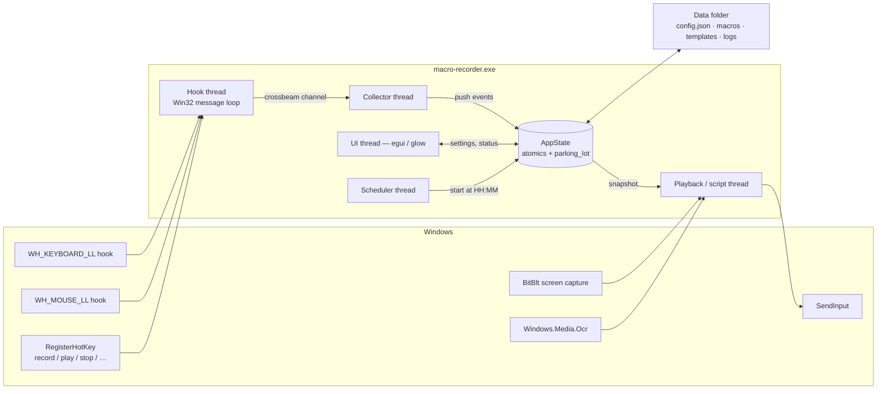
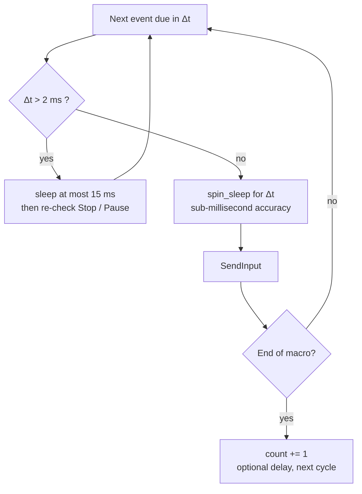
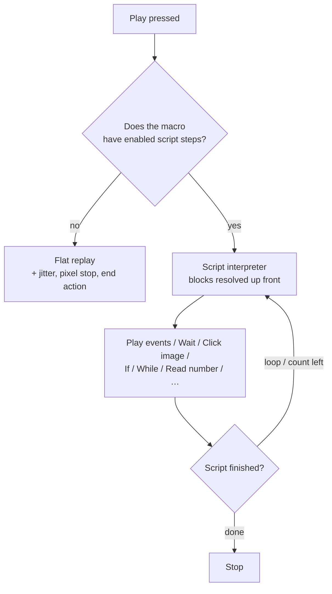
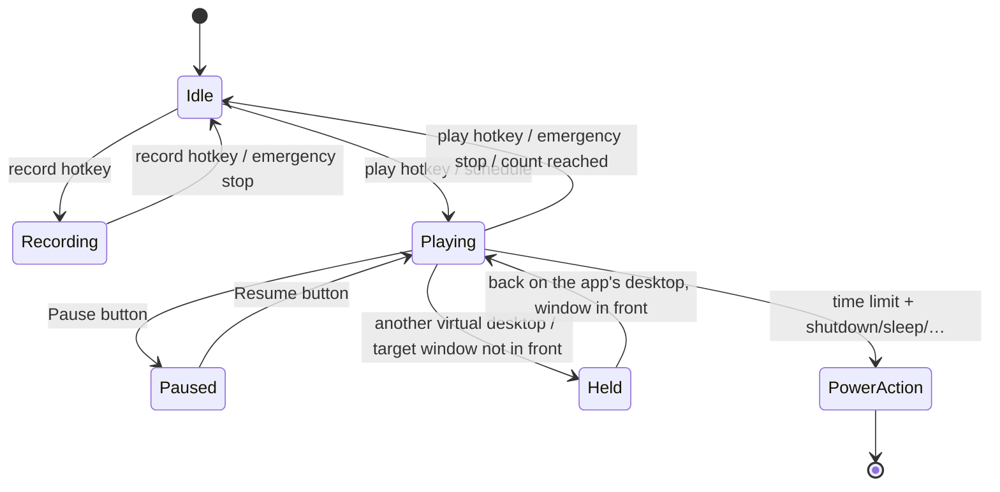

<div align="center">


# 🦀 Macro Recorder

**A modern, open-source alternative to TinyTask.**
*Born from Roblox grind. Forged in Rust.*

[](LICENSE)
[]()
[]()
[]()
[](https://github.com/blackixxce12/macro-recorder/releases)

*Record mouse & keyboard → replay it forever, exactly N times, or until a timer runs out → or write a little program that watches the screen and decides for itself.* ☕

[📥 Download](../../releases) • [✨ Features](#-features) • [🧠 Scripts](SCRIPTS.md) • [🆚 vs TinyTask](#-macro-recorder-vs-tinytask) • [🇷🇺 Русская версия](README_RU.md)


</div>

---

## 🆕 Highlights

| | |
|---|---|
| 📸 **Record straight into pictures** | Tick one box and every click keeps a small square of the screen. Stop recording and it offers to turn those clicks into steps that find the button **wherever it has moved to** — the keystrokes and timing between them untouched |
| ⚠️ **A step that finds nothing can say so** | Carry on, stop the script, leave the loop, or try again *N* times. Before 1.5.0 there was only the first, which is how a night macro ends up clicking at an empty desktop until morning |
| 🧠 **Script engine** | 24 step kinds with `If` / `While` / `Break`, variables that hold numbers **or text**, eight conditions that look at the screen, and **`Call macro`** for reuse. **[Full guide → SCRIPTS.md](SCRIPTS.md)** |
| 🔎 **Image search** | Paste a snippet with `Win+Shift+S` and the macro can wait for it, or click it wherever it appears — told **where** to look, and now on a capture path that costs **0.12 ms instead of 6** |
| 🔬 **Watch it think** | A window listing every variable as the script runs, plus **pause before each step** |
| 🪟 **UI Automation** | Ask Windows for a button by name: no threshold, no resolution, no theme. 9.5 ms, and silent in anything that draws its own interface |
| 🔤 **Text on screen (OCR)** | Uses the recognition already built into Windows — five preparation profiles, an expected format, and a fit score |
| 📅 **Scheduler** | Start the macro at a set time on chosen weekdays, even while minimised to the tray |
| 🪟 **Target window** | Pause automatically whenever your game or app isn't the one in front |
| 🖱 **Human-like movement** | Curved cursor paths with a random arc, plus an aim-spread in pixels |
| ✂ **Built-in editor** | A plain-English list of what you did, a raw event list, and a per-action inspector — with undo |
| ⚙ **Compile to a standalone .exe** | Export a self-running player — scripts included. No compiler involved |
| ⚓ **Window anchoring** | Follows the target window if it moved *or was resized* |
| ⌨ **Live speed control** | Hotkeys for faster / slower / skip-this-step, usable mid-run |
| 👁 **See what it looks at** | A see-through window over everything, drawing the search area, the match and its score |

<details>
<summary>Under the hood</summary>

Pause/resume with a proper schedule clock · 7 rebindable hotkeys + emergency stop · X1/X2 capture ·
Open/Save dialogs and recent files · gzip `.mrz` macros · shutdown/restart/sleep/hibernate/log-off ·
headless CLI · Fluent (Mica) theme · 9 themes · 6 languages · timing jitter · single instance ·
rotating log file · virtual-desktop isolation · per-monitor DPI awareness.

</details>

---

## 📑 Contents

- [The story](#-the-story-roblox-anime-tower-defenses-and-a-tired-hand)
- [Why Rust](#-why-rust)
- [Macro Recorder vs TinyTask](#-macro-recorder-vs-tinytask)
- [Features](#-features)
- [How it works](#-how-it-works)
- [Hotkeys](#️-hotkeys)
- [Scripts](#-scripts)
- [Image search](#-image-search)
- [UI Automation](#-ui-automation)
- [Text on screen (OCR)](#-text-on-screen-ocr)
- [Editor](#-editor)
- [Schedule & target window](#-schedule--target-window)
- [Exports & extras](#-exports--extras)
- [Themes](#-themes)
- [Languages](#-languages)
- [Files & folders](#-files--folders)
- [Command line](#-command-line)
- [Download](#-download)
- [Build from source](#️-build-from-source)
- [Known limitations](#️-known-limitations)
- [FAQ](#-faq)
- [License & credits](#-license--credits)

---

## 📖 The story: Roblox, anime tower defenses, and a tired hand

I play a lot of **Roblox** — especially anime tower defense games. If you've ever played one, you know *the loop*:

> Place units → wait for the wave → collect gems → upgrade → repeat.
> And again. And again. **Hundreds of times per session.**

One evening, after manually clicking the same "summon / upgrade / claim" buttons for the third hour in a row, my hand said *«no»*. So I did what everyone does — I downloaded **TinyTask**.

And honestly? **It worked.** TinyTask is a genuinely great piece of software: 36 KB of hand-written C that has been quietly automating people's work since the Windows XP era. It's a masterclass in minimalism, and this project would not exist without it.

But minimalism cuts both ways. After a few evenings of farming I kept hitting the same walls:

- ⏰ **No "stop after N hours"** — I wanted to farm while asleep and have the PC shut itself down afterwards. TinyTask can loop forever or loop N times, but it has no concept of *time*;
- 🖥️ **Absolute pixel coordinates, no DPI awareness** — change Windows scaling from 100% to 125%, dock a laptop, or move the game to another monitor, and every click lands in the wrong place;
- 🔒 **Closed source** — a tool that installs global keyboard hooks and injects synthetic input into my system is exactly the kind of tool I'd like to be able to *read*;
- 🧾 **Binary `.rec` files** — I wanted to tweak a macro in a text editor, not re-record it;
- 🌍 **No Russian / Ukrainian / Chinese UI**;
- 🎨 **A fixed toolbar from 2007** — charming, but I stare at this window for hours.

So I built the tool I wanted. And then a second wall showed up: **a blind recording is dumb.** If the wave takes 4 seconds longer than usual, a fixed replay clicks into empty space and the whole run is wasted. What I actually needed was *"wait until the Claim button appears, then click it"*.

That's what the [script engine](SCRIPTS.md) is for. A macro can now look at the screen — for a picture, a pixel colour, a window, or a word of text — and decide what to do. It's still a recorder first: you record the boring part, and add a few conditions on top only where you need them.

That weekend project got slightly out of hand. 🦀

---

## 🦀 Why Rust?

| Reason | What it means for you |
|---|---|
| **Single .exe** | No installer, no .NET, no Python runtime — one file, double-click, done |
| **Fearless concurrency** | Five roles run in parallel — low-level hooks, an event collector, a microsecond-accurate replay engine, a scheduler and the GPU-rendered UI — and the compiler guarantees they don't corrupt each other's state |
| **Memory safety** | A tool that injects input into your system shouldn't scribble over an event buffer mid-raid. Outside the thin `unsafe` Win32 FFI layer, Rust makes whole classes of bugs impossible |
| **Small & instant** | With `opt-level = 3` + LTO + `strip`, the whole app is a few MB and starts instantly |
| **Honest reason** | I wanted a real excuse to learn Rust properly. Best way to learn — build something you actually use |

---

## 🆚 Macro Recorder vs TinyTask

> **This table is fact-checked** against TinyTask's official website, changelog, FAQ and support pages (see [Sources](#sources-for-the-tinytask-column)). TinyTask is *not* a bad program — it's a deliberately minimal one. Where it wins, this table says so.

### Pick the right tool

| Pick **TinyTask** if… | Pick **Macro Recorder** if… |
|---|---|
| You need the smallest possible footprint (36 KB) | You want timed playback, pause/resume and power actions |
| You need to run on Windows XP / Vista / 7 | You're on Windows 10 / 11 with DPI scaling or multiple monitors |
| You want a 36 KB tool that also compiles macros to 60 KB executables | You want a macro that reacts to the screen instead of clicking blind |
| You want a tool that has been battle-tested for over a decade | You want open source you can audit, fork and extend |
| You just need "record → play", nothing more | You want an editor, conditions, image search, OCR and a scheduler |

### Full comparison

| | **TinyTask 1.77** | **Macro Recorder** |
|---|---|---|
| **License** | Freeware, **closed source** (proprietary) | **MIT, fully open source** |
| **Implementation** | Pure C + raw Win32, self-contained **32-bit** exe | Rust 2024 + `windows-rs`, **64-bit** exe |
| **Binary size** | **~36 KB** 🏆 | ≈5 MB (GPU UI, 9 themes, 6 translations, vision + OCR) |
| **Install** | Portable single exe (optional Inno Setup installer) | Portable single exe |
| **Supported Windows** | **XP → 11** 🏆 | 10 / 11 (Windows 11 for Mica/Acrylic + virtual desktops) |
| **UI** | Fixed Win32 toolbar, user-swappable toolbar bitmaps | GPU-rendered `egui`, **9 themes**, live theme switching |
| **Window translucency** | ❌ | ✅ per-pixel alpha + **DWM Mica / Acrylic** |
| **UI languages** | Separate **localized builds** (FR, DE, IT, PT, ES, SV) since v1.74 — no in-app switch | **6 languages switchable at runtime** (EN, RU, UK, PT, ES, ZH) + auto-detect |
| **Keyboard capture** | ✅ | ✅ virtual key **+ scancode + extended flag** |
| **Mouse move & clicks** | ✅ | ✅ (L / R / M) |
| **Mouse wheel** | ⚠️ documented as unavailable with some mice | ✅ **vertical + horizontal** |
| **X1 / X2 side buttons** | ❌ | ✅ recorded and replayed |
| **Ignores its own injected input** | not documented | ✅ `LLKHF_INJECTED` / `LLMHF_INJECTED` filtered |
| **Hotkeys excluded from recordings** | ✅ by design | ✅ |
| **Repeat playback** | ✅ continuous **or** N times | ✅ continuous **or** N times (1–9999) |
| **Delay between loops** | ❌ (bake it into the recording) | ✅ 0–600 000 ms |
| **Pause / resume** | ❌ | ✅ without losing the position |
| **Stop after a time limit** | ❌ | ✅ **hours : minutes : seconds** |
| **Action when the limit is hit** | ❌ | ✅ stop · **shut down · restart · sleep · hibernate · log off** |
| **Playback speed** | ✅ presets (½×, 1×, 2×, 100×) + custom value | ✅ **0.1× – 3.0×** slider, **changeable mid-run by hotkey** |
| **Timing jitter** | ❌ | ✅ optional 0–50 % per-event randomisation |
| **Human-like cursor paths** | ❌ | ✅ Bézier arcs + aim spread in pixels |
| **Live recording timer** | ❌ (playback shows a countdown since v1.61) | ✅ live timer while recording + final duration |
| **Live playback counter** | ❌ | ✅ `plays: 7 / 50` in the UI |
| **Global hotkeys** | `Ctrl+Alt+Shift+R` / `Ctrl+Shift+Alt+P`, a few alternatives in Prefs | ✅ **7 rebindable slots** (any key × Ctrl/Alt/Shift), applied without restart |
| **Emergency stop key** | ✅ Break / ScrollLock / Pause | ✅ **F9** by default, rebindable |
| **Always on top** | ✅ (since v1.61) | ✅ toggle at runtime |
| **Settings persistence** | ✅ portable `.ini` (since v1.50) | ✅ human-readable **`config.json`** + autosave on exit |
| **Macro format** | Proprietary binary `.rec` | **Plain JSON** with µs timestamps, optional gzip (`.mrz`) |
| **Edit a recording** | ❌ in the classic build (a "With Editor" build exists on the official site) | ✅ **built-in editor** (3 views + inspector) + any text editor |
| **Open / Save dialogs, recent files** | ✅ open & save | ✅ + a recent-files list |
| **Compile macro → standalone .exe** | ✅ ~60 KB output 🏆 | ✅ ~5 MB output (a copy of this exe + the macro **and its script**) |
| **Export to another tool** | ❌ | ✅ **AutoHotkey v2 script** (events only) |
| **Tray icon / minimize to tray** | ❌ | ✅ with a record / play / stop menu |
| **Window anchoring** | ❌ | ✅ follows the target window if it moved **or resized** |
| **Stop on a screen pixel** | ❌ | ✅ colour + tolerance, with a picker |
| **Scripting / conditional logic** | ❌ | ✅ **24 step kinds, `If`/`While`/`Break`, variables holding numbers or text, and `Call macro`** — [SCRIPTS.md](SCRIPTS.md) |
| **Image recognition** | ❌ | ✅ masked normalised cross-correlation, optional multi-scale |
| **Text recognition (OCR)** | ❌ | ✅ via `Windows.Media.Ocr` — no models to download |
| **Scheduler (start at a time)** | ❌ | ✅ time + weekdays, runs from the tray |
| **Pause while another window is in front** | ❌ | ✅ match by window title |
| **Settings profiles** | ❌ | ✅ named, unlimited |
| **User translations without a rebuild** | ❌ | ✅ `lang/xx.json` overrides |
| **Headless / scriptable run** | ❌ (the compiled .exe covers this) | ✅ `--play … --loops … --no-gui` |
| **Single-instance guard** | ❌ | ✅ focuses the running window |
| **Per-monitor DPI awareness** | ❌ raw pixel coordinates; scaling changes shift every click | ✅ **Per-Monitor v2** + coordinates normalized across the whole virtual desktop |
| **Relative (delta) mouse mode** | ❌ | ✅ toggle — useful for FPS-style camera input |
| **Virtual Desktop isolation (Win 11)** | ❌ | ✅ recording & playback pause when the app isn't on the active desktop |
| **Timing model** | Faithful replay of recorded timing | µs timestamps + `timeBeginPeriod(1)` + hybrid sleep / spin-sleep scheduler |
| **Log file** | ❌ | ✅ rotating daily log |
| **Antivirus false positives** | ⚠️ a known, long-standing issue | ⚠️ same — any input injector looks suspicious |
| **Price** | Free | **Free forever** |

### Where TinyTask still wins 🏆

Credit where it's due — two things TinyTask does that this project cannot:

1. **Size and reach.** 36 KB, 32-bit, runs on Windows XP. Its compiled macros are ~60 KB;
   ours are a ~5 MB copy of this executable, because the player *is* the whole app.
   If you need to email a macro to someone on an old machine, TinyTask wins outright.
2. **A decade of field testing.** TinyTask has been used by an enormous number of people for
   many years. Macro Recorder is young — please [file issues](../../issues).

### Sources for the TinyTask column

Facts above were taken from the official TinyTask site rather than SEO mirrors (several of which contradict each other and the vendor's own changelog):

- Official changelog — <https://www.tinytask.net/revision_history.html>
- Official FAQ — <https://www.tinytask.net/faq.html>
- Official support page (hotkeys, emergency stop) — <https://www.tinytask.net/support.html>
- Official downloads (v1.77, "With Editor" builds) — <https://www.tinytask.net/download.html>
- The Portable Freeware Collection entry — <https://www.portablefreeware.com/index.php?id=1853>

---

## ✨ Features

**Capture**

- 🔴 Mouse movement, clicks, wheel (vertical *and* horizontal), **X1/X2 side buttons**, and the full keyboard — including scancodes and extended keys, so layouts and NumPad behave correctly
- 🎚 Movement sampling is configurable (1–100 ms, default 5 ms), or can be **switched off entirely** for click-only macros
- 🚫 The recorder ignores its own synthetic events *and* your own hotkeys, so neither ends up inside the macro
- 📸 **Snip a picture at every click** — keeps a square of the screen around each click so the recording can become a macro that finds its buttons instead of trusting coordinates

**Replay**

- ▶ Microsecond scheduling: a 1 ms system timer plus a hybrid sleep/spin-sleep loop, so long macros don't drift
- 🔁 Loop forever, **exactly N times** (1–9999), or **until a time limit**, with an optional delay between loops
- ⏸ **Pause and resume** — the schedule clock stops with you, so nothing fast-forwards afterwards
- ⚡ Speed **0.1× – 3.0×** (and live `faster` / `slower` hotkeys), plus optional **timing jitter** (0–50 %)
- 🖱 Absolute or relative mouse mode, optional **human-like curved movement** and per-click aim spread
- 🎛 **Playback profiles** — *Desktop*, *Game*, *Human-like*: names for the combinations of the settings above that actually go together
- 🛟 Stop always releases whatever the macro was holding down — no stuck Shift, no stuck mouse button

**Decide, don't just replay**

- 🧠 A **[script](SCRIPTS.md)** can wait for things, branch, loop and count — while still replaying slices of your recording
- 🪟 **UI Automation**: ask Windows for a button by name and let the application press it — no threshold, no coordinates
- 🔎 **Image search**: find a button anywhere on screen and click it, even if the layout shifted — told *where* to look, with two thresholds, variant folders and outline matching
- 🔤 **OCR**: react to a word on screen, or read a number (gems, timer, HP) into a variable, with five preparation profiles and a format check
- 🎯 **Pixel condition**: watch one pixel and stop — or shut the PC down — when it changes
- 📝 Variables hold **numbers or text**, so what was read, what the window is called and what is on the clipboard can all be kept and compared
- 👁 A **see-through overlay** shows where the last search looked and what it found
- 🔬 A **variables window** shows what it has worked out, with an optional pause before every step
- ⚠️ Every step that looks for something says **what to do when it is not there** — carry on, stop, leave the loop, or retry
- 📞 **`Call macro`** runs another macro file's script as a subroutine, sharing the variables

**Build it without building it** *(new in 1.6.0)*

- ✅ **Multi-select** — Ctrl+click and Shift+click, then duplicate, delete, enable, disable, or **wrap in If / Repeat / Group** in one press
- 📁 **Group** — a name for a run of steps, with no effect on how the macro runs. A list of forty steps reads as six things
- 🧩 **Twelve templates** — wait for a button then click it, handle a popup, log in, retry-and-recover, farm until a counter, run until a time, and more. Inserted as ordinary steps and edited like any others
- 📚 **Macro library** — every macro in your `macros/` folder, insertable into this one as a call
- 🧹 **Optimize recording** — strips hand tremor, auto-repeat, the walk to the starting position and idle time past two seconds. **Shows you what it would remove before it removes anything**
- 💬 **The flow steps read as English** — *Repeat while*, *Do this if*, *Otherwise*, *Stop the loop*. Same model underneath; every existing macro is unchanged

**Survive the night** *(new in 1.6.0)*

- 🩹 **Recovery blocks** — a fifth answer to *what if it is not there*: run a named block of steps, then try once more. Retrying is right when the thing was not there yet; it is useless when something is *in the way*, and this deals with the obstruction
- 📈 **Step statistics** — how many times each step ran, how often it worked, its average and its worst time, kept against the step itself rather than its position
- ⌛ **Adaptive waits** — wait as long as this step has usually needed, learned from the run history, with your number still the ceiling
- 🪟 **Window actions** — activate, minimize, maximize, restore, move, resize, centre, close, and wait until a window is in front, appears or closes. One step, one dropdown
- 🎯 **Target window by program, not just title** — `roblox` finds `RobloxPlayerBeta.exe`, and it is found again if the game restarts
- 📋 **Clipboard as a step**, including **wait until it changes** — how a macro knows a copy happened rather than guessing at a delay
- 🔤 **Nine built-in values** — `{clipboard}`, `{window.title}`, `{time}`, `{mouse.x}` and the rest, in any text field
- 🔔 **Notify** from the tray, and 📷 **Screenshot** to a file

**Record intent, not coordinates** *(new in 1.6.0)*

- 🎯 **Targets** — one step says *what* to press; the program carries every way of finding it that was available when you recorded, and tries them in order: UI element → image → text → window-relative → coordinate. The button moves, the theme changes, the window is re-opened somewhere else, and the step still works
- 🎚 **Reliability: Maximum · Balanced · Fast** — the whole interface to that cascade. You pick a word, not an order of methods
- 🔬 **Analyze recording** — after recording, a table of what each click is now and what it could be, with a tick per row. *Apply* rewrites the script
- 🧠 **Recording remembers what was clicked** — the window, the process, the window rectangle, and the interface element under the cursor, all captured at the one moment they are free
- 🔖 **Markers** — a name for a place in the recording, so `Play events 73…184` stops meaning something different every time you edit

**Rehearse, check, diagnose** *(new in 1.6.0)*

- 🧪 **Test run** — play the whole macro with nothing sent. Pictures are still searched for, text still read, variables still counted; every click and keystroke is counted instead of sent, and the two steps that reach past the input queue are stepped over
- 🖼 **A screenshot and an explanation when a step gives up** — `the best match for "claim" scored 0.41, and the step asks for 0.85`, with what to try next. No model, no network: every number in that sentence was already known
- 📜 **Run history** — what happened the last twenty times, newest first, with the screenshot attached
- 🛡 **Macro health** — check it without running it: missing pictures, `Play events` ranges that no longer fit the recording, loops with no way out, fixed coordinates, plus a reliability score and a plain list of what this macro is able to do
- ⌨ **Ctrl+K** — type part of a name, get the command

**Automation & safety**

- ⏱ Time limit in `H : M : S`, then: stop · shut down · restart · sleep · hibernate · log off
- ⏳ Shutdown/restart use a visible countdown (0–600 s, default 60) — `shutdown /a` still aborts it
- 📅 **Scheduler** — start at `HH:MM` on the weekdays you tick, even from the tray
- 🪟 **Target window** — automatically pause while your game isn't the window in front
- 🧭 **Per-monitor DPI aware (v2)** — Windows reports true physical pixels, so 125%/150% scaling doesn't silently offset your clicks
- 🚀 **Desktop Duplication capture** — the compositor hands over the frame it already has instead of GDI fetching it back; ~5× on a whole screen, ~20× on a region, and it falls back to the old path by itself where a machine will not run it
- 🪟 **Virtual Desktop isolation (Windows 11)** — if the app lives on Desktop 2, it neither records nor replays while you're working on Desktop 1
- 🔒 **Single instance** — launching it twice just focuses the existing window

**Interface & files**

- ⌨ 7 rebindable global hotkeys, including a dedicated **emergency stop** (default `F6` / `F7` / `F8` / `F9`)
- 📌 Always on Top toggle
- 🎨 **9 themes** + a transparent UI switch, with Windows 11 **Mica** and **Acrylic** backdrops (and a blur fallback on Windows 10)
- 🌍 **6 languages**, auto-detected and switchable at runtime
- 📦 Macros as plain JSON — or gzipped `.mrz` when size matters — with Open/Save dialogs and a recent-files list
- 💾 Settings in a readable `config.json`, saved on demand and on exit
- 📝 A rotating daily log file for when something behaves oddly
- 🖥 A headless CLI for scripts and scheduled tasks

---

## 🧠 How it works

### Architecture



Nothing blocks the UI, and nothing blocks the hook callback — a low-level hook that stalls gets silently dropped by Windows. So the callback does the absolute minimum: two atomic loads, a cached window handle, a cached virtual-desktop answer, then it hands the event off through a lock-free channel.

### The replay scheduler

Naive `sleep()` loops drift badly over a two-hour macro, and a single long `sleep()` makes the Stop key feel broken. The engine schedules every event against one monotonic clock and never sleeps for more than ~15 ms at a time:



`timeBeginPeriod(1)` is requested for the duration of playback only and released afterwards, so the app doesn't keep the whole system on a high-resolution timer while idle.

### Two playback modes

A macro with **no script** is replayed flat: event by event, on the recorded timing. A macro **with a script** hands control to the interpreter instead, and the recording becomes a library of slices the script can play (`Play events 0…240`).



### State machine



Entering **Paused** or **Held** releases anything the macro was holding down and freezes the schedule clock — so returning after ten minutes resumes exactly where you left off instead of replaying ten minutes of backlog at full speed.

---

## ⌨️ Hotkeys

| Action | Default | Notes |
|---|---|---|
| Start / stop **recording** | `F6` | Rebindable |
| Start / stop **playback** | `F7` | Rebindable |
| **Pause / resume** | `F8` | Rebindable, or use the UI button |
| **Emergency stop** | `F9` | Stops recording *and* playback |
| **Faster** | unbound | ×1.25 speed, applied instantly mid-run |
| **Slower** | unbound | ×0.8 speed, applied instantly mid-run |
| **Skip step** | unbound | Abandons the current step (or the rest of the current `Play events` range) |

All slots are registered globally with `MOD_NOREPEAT`, so they work while any application has focus, and they are filtered out of the recording. Each can be combined with **Ctrl**, **Alt** and **Shift**, and changes apply immediately — no restart.

Click the key button and press anything — letters, digits, function keys. While binding, the global
hotkeys are released so you can even swap `F6` and `F7` around; Esc or 15 seconds of silence cancels.
The ▾ list next to it covers keys the window never receives, such as `Pause`, `ScrollLock` and the
NumPad. **Clear** unbinds a slot entirely.

> If another application already owns one of your combinations, the app says so under **⌨ Hotkeys** instead of failing silently — pick a different key or add a modifier.

---

## 🧠 Scripts

A recording replays what you did. A **script** decides *whether* and *how many times* to do it.

```
0  While  gems < 500
1      Wait for  image: claim_button ≥ 0.85  appears  (10000 ms)
2      Click image: claim_button ≥ 0.85
3      Play events 0…240  (241/241)
4      Read number (1620,40 300x80) → gems
5  End while
6  Quit the app
```

Steps live inside the macro file, so a scripted macro is still one `.json` you can save, share and export to `.exe`.

**24 step kinds:** `Play events` · `Wait` · `Wait for` · `Click image` · `Find image` · `Click at` · `Key` · `Set` · `If` · `Else` · `End if` · `While` · `End while` · `Break` · `Run` · `Quit the app` · `Note` · `Read number` · `Read text` · `Get text` · `Put text` · `Find element` · `Press element` · **`Call macro`**

**8 conditions:** `always` · `variable` · `image` · `pixel` · `window` · `text` · `process running` · `element on screen`

> 📘 **The complete, click-by-click guide lives in [SCRIPTS.md](SCRIPTS.md)** — including every step kind, every condition, the built-in variables, three worked examples and a troubleshooting table. Start there; this section is only the summary.

Open the editor (**✂ Editor → Open editor**), switch to the **Script** tab, pick a kind from the dropdown and press **Add**. Blocks are checked before anything runs: an unbalanced `If` is reported in the editor and the script is refused rather than half-executed.

---

## 🔎 Image search

Under **🔎 Image search** in the main window.

1. Snip the button you care about with `Win+Shift+S`, then press **📋 Paste**. (Or **📂 Load PNG…**.)
2. Press **🔍 Find on screen**. The result reads `Found at (x, y) — 0.973` or `Not found (best 0.412)`.
3. Press **💾 Save PNG…** into the `templates/` folder — scripts refer to templates **by file name**.

**Confidence** (0.30–1.00, default 0.85) is a normalised cross-correlation score: `1.00` is pixel-identical, `0.85` tolerates antialiasing and mild colour shifts. Because the score is normalised, a template still matches when the game's brightness or theme changed.

Fully transparent pixels in a PNG are **excluded from the score**, so you can cut a round icon out of its background in any editor and match it on any backdrop.

| Option | Effect |
|---|---|
| **Try other scales** | Also tests 0.8×, 0.9×, 1.1×, 1.25× — for when the window is a different size than when you snipped it |
| **Search area only** | Restricts the sweep to one rectangle |
| **Show what the script looks at** | Opens the see-through overlay described below |

> ⚠️ **Try other scales applies to the test button only** — a scripted search is always at 1.0×. The answer to a different display is the sidecar below, not a scale sweep.

The search runs on a worker thread, so the window never freezes; a full-screen sweep takes a moment and shows a spinner.

### Telling a script where to look

Every image step and image condition carries its own **search area**: the whole screen, the window in front, a fixed rectangle, near where the same picture was last seen, or relative to another picture. It is the single most useful field in the release. Measured on a 2560×1440 desktop with `--selftest vision`, one step looking for a 64×64 template:

| Area | Capture | Search | Total | Looks per second |
|---|---|---|---|---|
| 2560×1440 | 10.4 ms | 22.0 ms | 32.4 ms | 31 |
| 1280×720 | 3.3 ms | 6.6 ms | 9.9 ms | 101 |
| 400×300 | 0.6 ms | 1.2 ms | 1.7 ms | 584 |
| 200×150 | 0.1 ms | 0.5 ms | 0.6 ms | 1582 |

**Relative to another picture** is the one no threshold can replace. A row of identical buttons is identical; which one to press is decided by the heading above it, and an anchor is how a script says so.

The capture column is what 1.5.0 changed, and the change is larger than the search itself now. See [How a capture got twenty times cheaper](#how-a-capture-got-twenty-times-cheaper).

### What happens when it is not there

Every step that looks for something carries one more field: **if not found**.

| Answer | For |
|---|---|
| **Carry on** | A poll inside a `While`. What every version before 1.5.0 did, always — and still the default, so nothing you already wrote has changed. |
| **Stop the script** | Everything else. A macro that has lost its footing should stop, not keep going. |
| **Leave the loop** | A loop watching for one of several things. |
| **Try again *N* times** | An interface that is still drawing itself. Waits between tries, and stops the run if it is still not there — a retry that gives up quietly is the trap this field exists to close. |

A step with anything other than *carry on* shows it in the script list, so the places a run can end are visible without opening each step.

### Recording straight into picture steps

Under **🎬 Recording**, tick **Snip a picture at every click**. From then on a
recording keeps a square of the screen (64 px by default, 16–512) from around every
click. When you press stop, the program offers to turn those clicks into `Click
image` steps.

Accept and it writes each square into `templates/` as `rec_<date>_<nn>.png` with its
DPI sidecar, then rewrites the macro as a script. Everything between one converted
click and the next stays a `Play events` step over exactly that range, so the
keystrokes, the scrolling and the recorded timing all survive — only the clicks
become pictures.

Two things it deliberately does not do:

- **A drag is left alone.** Press, move, release is not a click that a picture can
  stand in for, so it stays inside its `Play events` range where it still works.
- **The generated steps stop the script when the picture is not found**, rather than
  carrying on. A step this program wrote, that cannot find the button it was cut
  from, has nothing useful to do next. The offer has a combo box on it if you
  disagree.

The pictures are ordinary PNGs with machine-made names. Renaming them to something
meaningful — and editing the steps to match — is expected, and cropping them tighter
in any image editor usually helps.

### Living with a picture that moves, fades or changes theme

| Feature | What it is for |
|---|---|
| **Two thresholds** | A score wobbling around one threshold reads as several state changes a second. A lower one to *lose* the picture turns that into one. |
| **Stable N of M** | Tells an object (0.82, 0.84, 0.83) from a flicker (0.83, 0.51, 0.74). |
| **A folder of variants** | `templates/Claim/` holding `normal.png`, `hover.png`, `dark.png` is one step, not three. |
| **Outlines** | Correlates shapes instead of shades — survives a theme change and a highlighted row, at about 1.6× the cost. |
| **A scale sidecar** | Saving a template writes `Name.png.json` with the display scale it was cut at, and loading rescales it for the display it will be looked for on. Templates made before 1.4.0 have no sidecar and are left alone. |

### How a capture got twenty times cheaper

The interesting part is that the obvious explanation was wrong, and measuring said so.

Every look at the screen used to create a device context and a bitmap and destroy
them again, allocate and zero a fresh buffer, `BitBlt` into the bitmap, `GetDIBits`
the whole thing back out a second time, and then walk every pixel swapping red with
blue. All of that is real work and all of it is gone: a DIB section means `BitBlt`
writes straight into memory this process can read, the context and bitmap are kept
between captures, and a `Frame` now carries which order its bytes are in rather than
being rewritten to hide it. (That last one was undoing itself — `capture` swapped
BGRA into RGBA and `upscale_to_bgra` swapped it back on the way to the OCR engine.)

Removing all of that changed the number by nothing at all.

`--selftest vision` prints the split under **Where a capture goes**:

| Region | `GetDC` | `BitBlt` from screen | The same blit, memory to memory |
|---|---|---|---|
| 320×240 | 0.01 ms | 6.07 ms | 0.10 ms |
| 640×480 | 0.01 ms | 6.08 ms | 0.22 ms |
| 2560×1440 | 0.01 ms | 23.9 ms | 3.18 ms |

`BitBlt` out of the composited desktop costs about six milliseconds *before it has
copied a useful pixel*. The destination was never the expensive part — the table
prices the new DIB section against the device bitmap it replaced and they come out
equal. The readback was.

So 1.5.0 stops asking GDI. **Desktop Duplication** is the interface the compositor
offers for exactly this: it hands over the surface it already has, only the requested
rectangle crosses to the CPU, and a frame that has not changed is not sent at all —
so a script polling a settled screen costs one sub-rectangle copy out of a texture
that is already there.

| | GDI | Desktop Duplication |
|---|---|---|
| 400×300, polled 200 times | 6.06 ms each | **0.12 ms each** |
| Whole 2560×1440 screen | 30.2 ms | **4.0 ms** |
| Of those 200 polls, frames the compositor never had to send | — | **196** |

It falls back to the old path by itself, per thread, whenever it cannot run: an older
display stack, a remote session, a rotated monitor, a rectangle spanning two screens,
or a driver that simply says no. The switch under **🔎 Image search** turns it off for
a machine where it runs badly rather than not at all.

**Is it the same picture?** That question took three attempts to ask properly.
Comparing two captures for equality fails on any screen with something live on it —
the first version of the check reported that 97 % of the frame had changed, and it
had, because there was a game running. What works is not a pixel count: cut a
template out of a frame taken the old way and look for it in one taken the new way.
Channels swapped and the correlation collapses; a row pitch ignored and the hit lands
somewhere else; the wrong monitor and it is out by a screen's width. `--selftest
vision` runs it every time and reports **0 px off, score 1.000**.

### Seeing what it sees

**Show what the script looks at** puts a see-through, click-through window over everything. While a script runs it draws the search area in blue, the match and its score in green or red, the rectangle text was read from in amber, and the interface element that was found in violet.

A failed search gives you `0.41`, and `0.41` cannot say whether it looked in the wrong place, at the wrong size, or at the right thing under a tooltip. A rectangle can. It is a diagnostic and is off by default.

### Watching what it knows

**Watch the run** opens a second window listing every variable and its value,
refreshed on every step, along with the step about to run and how many `Call` steps
deep it is. The overlay says where the script is looking; this says what it has found
out, and between them a failing macro usually explains itself.

**Pause before each step** turns the run into something you step through: it stops
before every step and waits for **▶ Next step**. Stop works while it is parked, and
so does closing the window — a run that only one button could free, in a program
whose whole point is a global stop key, would be a trap.

---

## 🪟 UI Automation

Instead of looking at the pixels, ask Windows what is on screen. Where it works this beats everything else here: an element found by its name is found at any resolution, under any theme, in any window size, with no threshold to tune — and pressing it goes through the application itself, so the cursor never moves and the window need not even be in front.

Steps **Find element** and **Press element**, and the condition **Element on screen**. An element is named by any of: its **Name** (the text a screen reader would read), its **Id** (the identifier the application gives it), and its **Kind** (`Button`, `Edit`, `Text`, `CheckBox`, …). Narrowing by kind is what keeps it fast. Measured against the window in front: 9 to 35 ms for an exact match, depending on how much that window exposes, which is faster than any picture search here — and several times that when the name has to be matched as a substring.

> ⚠️ **It only sees what an application chooses to expose.** Unity, DirectX, OpenGL and canvas-drawn interfaces expose nothing at all, and across a privilege boundary it is limited or silent. **In Roblox it will find nothing** — this is a feature for automating ordinary programs.

The arrangement that works is a cascade, cheapest and most reliable first:

```
element  →  picture  →  text  →  fixed coordinates
```

---

## 🔤 Text on screen (OCR)

Under **🔤 Text on screen**. It uses `Windows.Media.Ocr` — the recognition engine already installed with Windows — so there are **no models to download**.

**Pick the language you are reading, not the one Windows is in.** The *Reads in* dropdown lists the recognisers your Windows actually has; leave it on *the Windows languages* to keep the old behaviour. This matters more than it sounds: on a Russian Windows reading an English game, `Gems: 1,250` came back as `Gems :` with the digits lost, and the zero of `02:34` was read as a Cyrillic **а**. No amount of pixel preparation argues a recogniser out of the wrong alphabet — all five profiles returned the same wrong answer. Setting it to `en-US` on the same machine read `1,250` correctly. To add a language, install its pack in Windows Settings and restart the app.

1. Press **🎯 Pick in 3 s**, hover the **top-left** corner of the region, wait for the countdown, then hover the **bottom-right** corner.
2. The rectangle is captured and read immediately, so you can see exactly what the engine sees.
3. In any script step that needs a region, press **⤵ from the panel** to copy those four numbers in.

Small regions are upscaled automatically (Windows OCR returns nothing at all below ~40×40 px). Text matching is deliberately loose: case, extra whitespace and stray punctuation are ignored, because OCR output never matches a human reading character for character.

Numbers are parsed generously too — `Gems: 1,250` and `1 250` both read as `1250`, and a clock like `02:34` is converted to **154 seconds**.

### Preparing the pixels

The engine was built for documents — dark text, light paper, generous size — and it has no settings at all. Screen text is none of those, so everything that can be done has to be done to the pixels first. This is worth more than a second engine would be, and it adds nothing to the binary.

| Profile | What it does |
|---|---|
| **none** | only the enlargement the engine needs — what every earlier version did |
| **interface** | grey, contrast pulled out to the full range |
| **small text** | the same, enlarged harder |
| **game HUD** | grey, stretched, then cut to black and white at Otsu's threshold |
| **digits** | black and white, enlarged hard |
| **try each** | walks the list and keeps the reading that best fits the expected format |

Light text on a dark panel is turned the other way round automatically: the engine reads dark-on-light markedly better.

### Saying what a reading should look like

A whole number, a decimal, a clock, or a small pattern — `#` a digit, `@` a letter, `?` one character, `*` any run. `##:##` matches `12:34` and not `1:34`. Deliberately not a regular expression: it has to be typeable by somebody automating a game, and it must not cost a crate.

**A reading that does not fit is refused, and the variable keeps its old value.** A mis-read clock is not a small error, it is a different number, and quietly writing a zero is worse than doing nothing.

Alongside it comes a **fit score** from 0 to 1 — half whether the format parses, half how much of the reading belongs to the alphabet that format implies. It is not the engine's confidence: that number is on a scale nobody can interpret and is not comparable between engines. The panel shows it next to the reading, so a profile can be chosen by comparing numbers instead of squinting.

---

## ✂ Editor

**✂ Editor → Open editor** opens a separate window with three views. Every action is undoable one step back.

| View | What it shows |
|---|---|
| **Story** | Plain English: *"Dragged with Left from (120, 340) to (700, 340)"*, *"Typed "hello""*, *"Waited 1.2 s"* |
| **Raw events** | Every event with its microsecond timestamp — the ground truth |
| **Script** | The program: add, reorder, enable/disable and edit steps |

**Per-action inspector** — click a line and edit its time, key, coordinates, delta, horizontal/extended flags; **Duplicate** or **Delete action**.

**Range operations** — pick a range with `from` / `to`, then:

| Action | What it does |
|---|---|
| **Delete** | Removes the range *and pulls the tail back*, so no silent gap is left behind |
| **Keep only** | Crops to the range and rebases it to t = 0 |
| **Drop moves** | Strips every mouse-movement event, leaving clicks and keys |
| **Trim lead-in** | Shifts everything so the first event happens immediately |
| **Insert pause** | Adds N ms at the selection point and shifts the rest |
| **Scale time ×** | Multiplies every timestamp — 2.0 makes the macro permanently twice as slow |
| **Replace in selection** | Swaps one mouse button for another across the range (Left → Right, …) |
| **Shift coordinates** | Adds `dX` / `dY` to every coordinate in the range |

**Insert click at match** — after a successful image search, one button inserts a real click at the found position, right after the selected action.

The editor is disabled while recording or playing.

---

## 📅 Schedule & target window

**📅 Schedule** — tick *Start at a set time*, choose `HH:MM` and the weekdays. A dedicated thread checks every 5 seconds, so it fires even when the window is minimised to the tray and no longer painting. If a recording or playback is already running at that minute, the launch is skipped and logged rather than stacked.

**🪟 Target window** — type a fragment of the window title (matching is case-insensitive and *contains*, so `roblox` matches `Roblox Player`). With *Pause while it is not in front* enabled, playback holds itself whenever something else takes focus, and resumes on its own when you come back. The status line reads **Waiting for the window…**.

Both are unrelated to **⚓ window anchoring**, which is about *coordinates*: turn on *Remember the target window* while recording, and the app stores the foreground window's title and rectangle inside the macro. On playback, *Follow the anchored window* finds it again and shifts every coordinate by however far it moved — and with *Scale with the window size*, stretches them if it was resized too.

---

## 🧰 Exports & extras

### ⚙ Export to a standalone `.exe`

**Files → Export .exe** produces a player that runs on any Windows PC with nothing installed.
It works by copying this executable and appending the macro to it: a PE image ignores trailing
bytes, which is the same trick self-extracting archives use — no compiler or linker is involved.
On startup the player finds its own footer and plays immediately; the emergency-stop hotkey
still works. The current loop count, speed, mouse mode and inter-loop delay are baked in.

**Scripts are included.** If the script uses image templates, copy the `templates/` folder next to
the exported `.exe` — the player looks for templates in its own folder, not in the original one.

### 📜 Export to AutoHotkey

**Files → Export .ahk** writes an AutoHotkey v2 script: `MouseMove` / `Click` / `Send` with
`Sleep` between events, wrapped in a `Loop`, and `Esc` bound to exit. Keys are emitted as
`{vkXX}` so non-US layouts survive the trip.

> ⚠️ This export covers **recorded events only** — script steps, conditions and variables are not translated.

### 🖥 Tray

Enabled in **Appearance**. Left-click toggles the window, right-click opens a menu with
record / play / emergency stop / exit. Turn on *"Close button minimizes to tray"* and the ✕
hides the window instead of quitting — useful for multi-hour unattended runs.

### 🎯 Pixel stop condition

Watch one screen pixel and stop when it matches a colour (or stops matching). Press
**Pick in 3 s**, hover the target, and both the coordinates and the colour are captured.
Tolerance is a per-channel ±value. The condition is polled about four times a second and,
when it fires, runs the same end action as the timer — so *"stop farming when the HP bar
turns red, then shut down"* is two checkboxes.

> ⚠️ This applies to **flat replay only**. In a scripted macro, use a `pixel` condition inside `Wait for` / `If` / `While` instead.

### 🗂 Profiles

Save the entire configuration under a name into `profiles/<name>.json` and switch between
setups with one click. Recent files are kept across switches.

### 🌍 Translations without a rebuild

Press **Export language template** to write `lang/xx.template.json` — a flat key/value dump of
every UI string. Translate the values, rename it to `lang/xx.json` (`en`, `ru`, `uk`, `pt`,
`es`, `zh`), and restart: your strings replace the built-in ones. Empty values and missing keys
fall back to the defaults, so a partial translation is fine.

---

## 🎨 Themes

| # | Theme | Notes |
|---|---|---|
| 0 | **Dark** | The default. Neutral grays, subtle shadows |
| 1 | **OLED (Pure Black)** | `#000000` panels, zero shadows — true black pixels stay off |
| 2 | **Material Design 3** | 20 px rounded widgets, and it **reads your Windows accent colour** from the registry |
| 3 | **Catppuccin Mocha** | The pastel favourite |
| 4 | **Nord** | Cold arctic blues |
| 5 | **Dracula** | Purple/pink on deep gray |
| 6 | **Glassmorphism** | Translucent panels + **DWM Acrylic** system backdrop |
| 7 | **Neumorphism** | The only light theme — soft shadows on `#E0E5EC` |
| 8 | **Fluent (Mica)** | Windows 11 **Mica** backdrop + your system accent colour |

The **Transparent UI** checkbox works on top of any theme. Glass requests Acrylic and Fluent requests Mica through `DwmSetWindowAttribute`; if the attribute isn't supported (Windows 10), the app falls back to classic `DwmEnableBlurBehindWindow`.

---

## 🌍 Languages

`English` · `Русский` · `Українська` · `Português` · `Español` · `中文`

The UI language is detected from `GetUserDefaultUILanguage()` on first launch and can be overridden in the dropdown at any time — no restart. CJK glyphs are loaded from the system fonts (`msyh.ttc`, `simhei.ttf`, `meiryo.ttc`) when present.

---

## 📁 Files & folders

### Where things live

The app picks its data folder at startup and shows the result under **📁 Files**:

1. **Next to the executable** — if that folder is writable (fully portable: USB sticks, `Downloads`, a game folder);
2. otherwise **`%APPDATA%\MacroRecorder\`** — so it still works from `Program Files` or a read-only location.

```
<data folder>/
├── config.json                  settings
├── macro.json                   default macro slot
├── my-farm.mrz                  gzipped macro (optional)
├── templates/
│   └── claim_button.png         pictures the script searches for
├── profiles/
│   └── farming.json             named settings profiles
├── lang/
│   └── ru.json                  optional translation overrides
└── logs/
    └── macro-recorder.log.YYYY-MM-DD
```

### `macro.json` — the recording (format v3)

`t_us` is microseconds since the recording started; `kind` is an externally-tagged enum. `duration_us` is the full length of the recording **including trailing idle time**, which is what makes a "do stuff, then wait 5 seconds" macro loop correctly.

```json
{
  "version": 3,
  "duration_us": 8000000,
  "anchor": { "title": "Roblox", "x": 100, "y": 80, "w": 1280, "h": 720 },
  "events": [
    { "t_us": 0,      "kind": { "MouseMove":   { "x": 960, "y": 540, "dx": 0, "dy": 0 } } },
    { "t_us": 128340, "kind": { "MouseButton": { "button": "Left", "down": true,  "x": 960, "y": 540 } } },
    { "t_us": 190002, "kind": { "MouseButton": { "button": "Left", "down": false, "x": 960, "y": 540 } } },
    { "t_us": 512900, "kind": { "Key":         { "vk": 65, "scan": 30, "down": true,  "extended": false } } },
    { "t_us": 560110, "kind": { "Key":         { "vk": 65, "scan": 30, "down": false, "extended": false } } },
    { "t_us": 900000, "kind": { "MouseWheel":  { "delta": 120, "x": 960, "y": 540, "horizontal": false } } }
  ],
  "script": [
    { "kind": { "While": { "cond": { "Var": { "name": "n", "cmp": "Lt", "value": 10.0 } } } }, "enabled": true },
    { "kind": { "PlayEvents": { "from": 0, "to": 5 } }, "enabled": true },
    { "kind": { "SetVar": { "name": "n", "op": "Add", "value": 1.0 } }, "enabled": true },
    { "kind": "EndWhile", "enabled": true }
  ],
  "vars": { "n": 0.0 }
}
```

| Field | Meaning |
|---|---|
| `version` | `3` — adds `script` and `vars`; v1 and v2 files still load |
| `t_us` | Timestamp in microseconds from the start of the recording |
| `anchor` | Title and rectangle of the window that was in front when recording started (optional) |
| `Key.vk` / `Key.scan` | Virtual-key code and hardware scancode. **Scancode wins on replay** when non-zero — that's what makes games and non-US layouts behave |
| `Key.extended` | Extended-key flag (arrows, NumPad Enter, right Ctrl/Alt…) |
| `MouseMove.x/y` | Absolute screen coordinates (used in absolute mode) |
| `MouseMove.dx/dy` | Delta since the previous sample (used in relative mode) |
| `MouseButton.button` | `Left` · `Right` · `Middle` · `X1` · `X2` |
| `MouseWheel.delta` | 120 per notch, negative = down/left |
| `MouseWheel.horizontal` | `true` for tilt-wheel / horizontal scroll |
| `script` | The program. Empty (or all steps disabled) means "just replay the events" |
| `vars` | Starting values for the script's variables. Anything unset starts at `0` |

**Compatibility:** version 1 files (a bare `[ … ]` array) and version 2 files still load. **Compression:** saving with a `.mrz` (or `.gz`) extension writes gzipped compact JSON, typically 20–40× smaller; both extensions load transparently.

**Validation on load:** unbalanced script blocks, an empty file, or more than 4 000 000 events are rejected with a message. Out-of-order timestamps are sorted rather than rejected.

### `config.json` — the settings

Written by **💾 Save settings** and automatically on exit. Unknown or out-of-range values are clamped instead of crashing, and missing keys fall back to their defaults — so a config from an older version keeps working.

**Appearance**

| Key | Type | Default | Meaning |
|---|---|---|---|
| `default_lang` | 0–6 | `0` | `0` = auto, `1` EN, `2` RU, `3` UK, `4` PT, `5` ES, `6` ZH |
| `default_theme` | 0–8 | `0` | Index into the theme table above |
| `transparent_ui` | bool | `true` | Translucent window |
| `always_on_top` | bool | `true` | Keep the window above others |
| `tray_enabled` / `close_to_tray` | bool | `true` / `true` | Tray icon; ✕ minimizes instead of quitting |

**Playback**

| Key | Type | Default | Meaning |
|---|---|---|---|
| `loop_play` | bool | `true` | Infinite looping |
| `play_count_limit` | 1–9999 | `1` | Used when `loop_play` is `false` |
| `speed` | 0.05–10.0 | `1.0` | Playback speed multiplier |
| `absolute_mouse` | bool | `true` | Absolute vs relative mouse replay |
| `repeat_delay_ms` | 0–600000 | `0` | Pause between loops |
| `jitter_pct` | 0–50 | `0` | Per-event timing randomisation (flat replay only) |
| `human_mouse` | bool | `false` | Curved cursor paths instead of teleporting |
| `human_curve` | 0–100 | `35` | How far the arc bows away from the straight line |
| `mouse_jitter_px` | 0–60 | `0` | Random spread applied to every target point |
| `use_window_anchor` | bool | `false` | Shift coordinates if the anchored window moved |
| `anchor_scale` | bool | `true` | Also stretch them if it was resized |

**Recording**

| Key | Type | Default | Meaning |
|---|---|---|---|
| `capture_mouse_moves` | bool | `true` | Record movement, not just clicks |
| `mouse_sample_ms` | 1–100 | `5` | Movement sampling interval |
| `record_window_anchor` | bool | `false` | Remember the foreground window when recording starts |

**Time limit & power**

| Key | Type | Default | Meaning |
|---|---|---|---|
| `time_limit_enabled` | bool | `false` | Enable the playback time limit |
| `time_limit_h` / `_m` / `_s` | 0–240 / 0–59 / 0–59 | `0` | Hours / minutes / seconds |
| `action_on_completion` | 0–5 | `0` | `0` stop · `1` shut down · `2` restart · `3` sleep · `4` hibernate · `5` log off |
| `shutdown_delay_s` | 0–600 | `60` | Countdown before shutdown/restart |

**Pixel condition**

| Key | Type | Default | Meaning |
|---|---|---|---|
| `pixel_enabled` | bool | `false` | Stop playback on a screen pixel |
| `pixel_x` / `pixel_y` | i32 | `0` | Watched screen coordinate |
| `pixel_r` / `_g` / `_b` | u8 | `255,0,0` | Target colour |
| `pixel_tolerance` | 0–255 | `20` | Per-channel tolerance |
| `pixel_mode` | 0/1 | `0` | `0` stop when it matches · `1` stop when it differs |

**Hotkeys, schedule, target window**

| Key | Type | Default | Meaning |
|---|---|---|---|
| `hotkey_record` / `_play` / `_pause` / `_stop` | object | F6 / F7 / F8 / F9 | `{ "vk": 117, "ctrl": false, "alt": false, "shift": false }`; `vk: 0` means unbound |
| `hotkey_faster` / `_slower` / `_skip` | object | unbound | Live speed control and step skipping |
| `schedule_enabled` | bool | `false` | Start the macro at a set time |
| `schedule_h` / `schedule_m` | 0–23 / 0–59 | `9` / `0` | When |
| `schedule_days` | bitmask | `127` | Bit 0 = Monday … bit 6 = Sunday |
| `target_title` | string | `""` | Window title fragment (max 120 chars) |
| `target_pause_unfocused` | bool | `false` | Pause while that window isn't in front |

**Files & image search**

| Key | Type | Default | Meaning |
|---|---|---|---|
| `recent_files` | array | `[]` | Up to 8 recent macro paths |
| `compress_on_save` | bool | `false` | Default to `.mrz` when saving |
| `img_threshold` | 0.3–1.0 | `0.85` | Confidence for the test search in the panel |
| `img_multiscale` | bool | `false` | Also try 0.8×–1.25× in the panel |
| `debug_overlay` | bool | `false` | The see-through window showing what the script looks at |
| `img_region_enabled` | bool | `false` | Restrict the panel search to a rectangle |
| `img_rx` / `_ry` / `_rw` / `_rh` | i32 | `0,0,800,600` | That rectangle |

---

## 💻 Command line

```
macro-recorder [OPTIONS]

  -p, --play <FILE>    Load a macro (.json / .mrz) on start
  -n, --loops <N>      Repeat count (0 = infinite)
  -s, --speed <X>      Playback speed multiplier (0.05 - 10.0)
      --no-gui         Play the macro headless and exit
      --simd <SET>     Pin the image-search kernel: auto (default), scalar,
                       sse2, avx, avx2, avx512. The -C target-cpu spellings
                       work too (x86-64-v3, znver3, …)
  -h, --help           Show this help
  -V, --version        Show the version
```

`--simd` exists to answer a question, not to be needed. Leave it at `auto` and the
program reads CPUID and picks; set it to a narrower kernel to see what a machine
without that instruction set would have felt like, or to rule the kernel out when
something looks wrong. A set this processor does not have is not an error — it says
so and runs the widest one it can.

Without `--no-gui` the options simply pre-load the GUI, which is handy for shortcuts:

```powershell
# Preload a macro and start the UI with it
macro-recorder.exe --play "D:\macros\farm.mrz"

# Run it 20 times without a window (Task Scheduler, .bat files, …)
macro-recorder.exe --play "D:\macros\farm.mrz" --loops 20 --speed 1.5 --no-gui
```

Scripts run in headless mode too. The emergency-stop hotkey still works.

### Self-tests

Not documented as a feature so much as a way to check a machine before trusting a
macro to it overnight. Each writes a table and a plain-English note on how to read it.

```powershell
macro-recorder.exe --selftest dryrun          # proves a test run touches nothing
macro-recorder.exe --selftest target          # the target cascade, on a real playback thread
macro-recorder.exe --selftest recovery        # recovery blocks: entered, returned from, capped
macro-recorder.exe --selftest vision          # capture, search and OCR, with numbers
macro-recorder.exe --selftest simd            # every instruction set in the .exe, raced and checked
macro-recorder.exe --selftest script          # the interpreter: miss policies, calls, step mode
macro-recorder.exe --selftest timing          # the replay scheduler under load
macro-recorder.exe --selftest churn=120       # the playback lifecycle, hammered
macro-recorder.exe --selftest soak=2          # hours of captures, watching handles and memory
```

`--selftest simd` answers "does this one .exe really use my processor?" — it lists
every kernel compiled into the binary, says which ones this CPU can run, races them
against each other on the same search and checks that they all find the planted
template in the same place. A kernel that is quick and wrong finds buttons in the
wrong place, and it would only do it on the machines that have it, so the agreement
column matters more than the milliseconds.

`--selftest vision` is the one to run after changing monitors: it prices a capture on
*this* machine and says whether Desktop Duplication is available here. `--selftest
script` takes a few seconds and exercises the 1.5.0 interpreter paths. Nothing any of
them do reaches the operating system — every `SendInput` call site is silenced for the
duration.

---

## 📥 Download

Grab the latest `.exe` from the **[Releases](../../releases)** page. No installation needed.

| File | Requires | Notes |
|---|---|---|
| `MacroRecorder.exe` | Any x86-64 CPU | One build. Picks its own instruction set at start-up |

There is no longer a separate `.v3.exe`. The image search — the one hot loop where
the instruction set is worth anything — is compiled **four times into the same
executable**, once each for baseline x86-64, AVX, AVX2 + FMA and AVX-512, and the
right one is chosen from CPUID when the program starts. Measured with
`--selftest simd` on a Zen 3, one 128×128 search over 1280×720, single-threaded:

| Kernel | `-C target-cpu` equivalent | ms | vs plain loop |
|---|---|---|---|
| scalar | *(fallback)* | 19.9 | 1.00× |
| sse2 | `x86-64`, `x86-64-v2` | 6.2 | **3.2×** |
| avx | `sandybridge`, `bdver1-4` | 4.9 | **4.1×** |
| avx2 | `x86-64-v3`, `znver1-3` | 4.7 | **4.2×** |
| avx512 | `x86-64-v4`, `znver4/5` | *(not on this CPU)* | — |

Most of that win is the first step, which every x86-64 machine now gets for free.
Run `--selftest simd` to see the table for your own processor, and `--simd <set>` to
pin one by hand.

> ⚠️ **Antivirus note:** macro tools install global input hooks and inject synthetic input, so unsigned builds get flagged as suspicious. This is a false positive that affects every tool in this category — TinyTask's own changelog has entries about fighting it too. That's exactly why the source is open: [build it yourself](#️-build-from-source) and trust your own binary.

---

## 🛠️ Build from source

```bash
# 1. Install Rust (1.98.0+, edition 2024): https://rustup.rs
# 2. Clone & build
git clone https://github.com/blackixxce12/Macro-Recorder.git
cd Macro-Recorder

# One build, for every processor. The image-search kernel is compiled four times
# into it and picks itself at start-up — no target-cpu flag needed.
cargo build --release

# Without the OCR backend (if WinRT bindings ever fail to build)
cargo build --release --no-default-features

# Tests (format round-trips, block balancing, config clamping, scheduler math)
cargo test
```

The binary lands in `target/release/`. Release profile: `opt-level = 3`, fat LTO, one codegen unit, symbols stripped, `panic = "abort"` — which is why the hook callbacks are written to be panic-free rather than relying on `catch_unwind`.

**Features:** `winocr` is on by default and provides text recognition through `Windows.Media.Ocr`. It ships no models — it uses the language packs already installed in Windows. `--no-default-features` disables it; everything else keeps working, and OCR steps report *"This build has no OCR backend"*.

**Icon:** `build.rs` embeds `assets/icon.ico` into the executable using [`winresource`](https://github.com/BenjaminRi/winresource), which needs a resource compiler — `rc.exe` (Windows SDK, comes with the MSVC toolchain) or `windres.exe` (MinGW). If it isn't found the build still succeeds; you just get a `cargo:warning` and no Explorer icon. The window icon comes from `assets/icon.rgba` and always works.

To watch what the app is doing, either read `logs/macro-recorder.log.*` or build in debug mode (which keeps a console attached) and set `RUST_LOG=debug`.

---

## ⚠️ Known limitations

Honest list — please read before filing a bug:

| Limitation | Detail |
|---|---|
| **Windows only** | Every capture/replay path goes through Win32. Non-Windows targets compile, but do nothing |
| **Pausing drops a drag in progress** | Held keys and buttons are released when you pause, so a macro paused mid-drag resumes without the drag |
| **One macro at a time** | Open/Save, recent files and profiles, but no tabs or queue |
| ~~**`Play events` ranges are still indices**~~ | **Fixed in 1.6.0.** Put markers down and tick *Use markers*, and the range follows your edits. The numbers stay visible underneath, and **Check macro** still catches a numbered range that no longer fits |
| **Exported `.exe` is ~5 MB** | The player is a copy of the whole app. TinyTask's ~60 KB output is smaller by design |
| **Templates aren't embedded** | An exported `.exe` that searches for images needs the `templates/` folder beside it |
| **AHK export ignores scripts** | Only recorded events are translated — conditions, loops and variables are not |
| **Scripted playback skips some flat-replay features** | Timing jitter, the global pixel stop condition and the end-of-run power action apply to flat replay only. Inside a script use a `pixel` condition and the `Quit the app` step instead |
| **No TinyTask `.rec` import** | The format is undocumented; a guessed parser would corrupt macros silently rather than fail loudly |
| **Coordinates are screen-absolute** | DPI awareness stops Windows from lying about pixels, but a *coordinate* still assumes the same window layout as when it was recorded. Since 1.6.0 a recorded click does not have to stay a coordinate: **Analyze recording** turns it into a target that finds its button by element, picture or window offset first. Maximize your target window before recording, or use anchoring, if you keep the coordinates |
| **Scripted image search is at 1.0×** | The "other scales" option applies to the test panel only. A template cut on a different display is handled by its scale sidecar, not by a scale sweep |
| **UI Automation sees nothing in games** | It only reports what an application chooses to expose. Unity, DirectX, OpenGL and canvas interfaces expose nothing, and across a privilege boundary it is limited or silent. In Roblox it will find nothing |
| **The overlay is a layered window, not a compositor effect** | It draws with GDI in physical pixels, which should keep it correct on a mixed-DPI desktop — that part has been reasoned about rather than measured. It is also a plain always-on-top window, so a game running exclusive full-screen will cover it; use borderless windowed while diagnosing |
| **Variables are numbers or text, and nothing else** | No lists, no tables. `Call macro` gives reuse, but it is a subroutine sharing one set of variables, not a function with parameters and a return value — those would turn the step list into a programming language, and a programming language cannot be edited with a mouse |
| **A called macro is a separate file** | `Call macro` names a file on disk. An exported standalone `.exe` carries only its own macro, so a called file has to be beside it |
| **Fast capture holds a GPU texture** | Desktop Duplication keeps a Direct3D device and a full-screen texture per thread so an unchanged frame can be reused; the process sits around 80 MB rather than 12. Untick **Fast screen capture** to trade that back for ~5× slower screen grabs |
| **Fast capture is one monitor at a time** | A search area spanning two screens, a rotated display, a remote session or an older display stack all fall back to the GDI path automatically — correct, just slower |
| **Snipped click pictures are 64 px of whatever was there** | Recording into picture steps cuts a fixed square around the cursor, background included. Crop them tighter in any editor if a step matches the wrong thing |
| **OCR depends on Windows** | Accuracy and available languages come from the language packs installed on your PC. Stylised game fonts read poorly |
| **Elevated windows** | Windows blocks synthetic input into higher-privilege windows. If your target runs as admin, run this as admin too |
| **Anti-cheat** | `SendInput` is standard synthetic input. Many games accept it; kernel-level anti-cheat may detect or block it |
| **Sleep/hibernate depend on the system** | If hibernation is disabled in Windows, that action fails and is logged rather than silently doing something else |

---

## ❓ FAQ

**Is this an auto-clicker / cheat?**
It's a macro recorder: it replays exactly what *you* did. What you automate is your responsibility — many games and services prohibit automation in their terms of service, and some ban for it. Read the rules of whatever you're automating.

**Do I have to learn scripting to use it?**
No. Record → Play works with no script at all, exactly like TinyTask. Scripts are opt-in for when a blind replay isn't enough — see [SCRIPTS.md](SCRIPTS.md).

**My script clicks the wrong place / never finds the image.**
Lower the confidence a little (0.85 → 0.75), re-snip the template *without* the shadow or the animated part around it, and check that the game is at the same resolution as when you snipped. The [troubleshooting table in SCRIPTS.md](SCRIPTS.md) covers this in detail.

**Why is it 5 MB when TinyTask is 36 KB?**
Because it ships a GPU-accelerated UI toolkit, 9 themes, 6 translations, a template matcher and a power/DPI/virtual-desktop layer. Different trade-off, on purpose. If size is your priority, TinyTask is genuinely the better answer.

**Where did my `config.json` go?**
Next to the exe if that folder is writable, otherwise `%APPDATA%\MacroRecorder\`. The app prints the exact path under **📁 Files**.

**Will my macro survive changing the resolution?**
Coordinates are absolute, so no — re-record after a resolution or monitor-layout change. Changing *DPI scaling* is handled, because the process is Per-Monitor v2 aware. A script built on image search survives far more than one built on fixed coordinates.

**Can I stop the auto-shutdown?**
Yes. It uses a system countdown (60 s by default, configurable) with a visible warning. Run `shutdown /a` in a terminal to abort it.

**Does playback record itself into an infinite loop?**
No. Injected events carry the `LLKHF_INJECTED` / `LLMHF_INJECTED` flag and are discarded by the hooks — as are your own hotkeys.

**Does it work in fullscreen games?**
Borderless/windowed-fullscreen works best. Exclusive fullscreen and raw-input games can be inconsistent, as with any `SendInput`-based tool. Screen capture (for image search and OCR) is also more reliable in borderless mode.

**Should I use `.json` or `.mrz`?**
`.json` while you're iterating — you can read and edit it. `.mrz` for long recordings you just want to keep: same data, roughly 20–40× smaller.

**Which language does OCR read?**
Whatever language packs Windows has installed. Add one in *Settings → Time & language*, restart the app, then pick it under **🔤 Text on screen → Reads in** — the recogniser reads in the language you choose there, not the one Windows is displayed in.

---

## 🤝 Contributing

Issues and PRs are welcome. If you're reporting a playback bug, please attach the macro file (or a trimmed version of it), the relevant part of `logs/macro-recorder.log.*`, and your Windows version, display scaling and monitor layout. For a script bug, the `Note` step writes straight into the log — sprinkle a few in and attach the result.

---

# 🛡️ Security & VirusTotal Verification

<p align="center">
  <a href="https://www.virustotal.com/gui/file/21cab5702a58699c1b2f14ac4dec322ea591cfed52cde2bb9e361e22496413a7/">
    
  </a>
  <a href="https://www.virustotal.com/gui/file/f345b6cf338ec6cf070a60e1cc594ae08fb41510f472e29c931553888e9c29a4/">
    
  </a>
  <a href="#-why-do-false-positives-occur">
    
  </a>
</p>

---

> [!NOTE]
> **Safety Notice:** All release binaries automatically undergo VirusTotal verification prior to every release. Out of **71 antivirus vendors**, 69 confirm the files are completely clean. The 2/71 detections are **100% False Positives**, caused by heuristic analysis of low-level Win32 input APIs and the lack of a paid code-signing certificate.

---

## 📊 VirusTotal Scan Results

| File / Build | SHA-256 Hash | VT Detection | VirusTotal Report |
| :--- | :--- | :---: | :---: |
| **MacroRecorder.exe** | `60b39eff30746a6f7e00fc6ec8f91bbdc377b4e38d319001e7292b156b02a818` | <mark>**2 / 71**</mark> | [🔍 View Report](https://www.virustotal.com/gui/file/60b39eff30746a6f7e00fc6ec8f91bbdc377b4e38d319001e7292b156b02a818?nocache=1) |
| **MacroRecorder.v3.exe** | `ce43ff5b81bab37f5b95fb6c9433eefbf33d357696bef1cf7933883789a8e48c` | <mark>**3 / 71**</mark> | [🔍 View Report](https://www.virustotal.com/gui/file/ce43ff5b81bab37f5b95fb6c9433eefbf33d357696bef1cf7933883789a8e48c?nocache=1) |

---

## ❓ Why Do False Positives Occur?

System-level input automation and simulation utilities frequently trigger heuristic warnings from lesser-known antivirus engines due to the following reasons:

1. **Low-Level Win32 APIs (`SendInput`, `SetWindowsHookEx`)**
   * Standard Windows API functions are used to intercept hotkeys and execute macros or emulate mouse and keyboard actions. Some heuristic scanners mistakenly flag global input hooks as potential keyloggers or autoclickers.
2. **Lack of a Commercial Digital Certificate (Code Signing)**
   * Signing `.exe` files with EV code-signing certificates is expensive. Unsigned binaries from open-source projects receive lower reputation scores from Windows SmartScreen and AI-driven antivirus engines.
3. **Rust Compiler Optimizations**
   * Compiling with target optimization flags (LTO, one codegen unit) and carrying four hand-written SIMD kernels — including AVX-512 that most machines will never execute — produces machine code patterns that automated scanners sometimes misinterpret as generic unknown threats (`Heur.BKG`, `Trojan.Generic`). Dispatching on CPUID is a normal thing for a fast program to do and a normal thing for a packer to do, and a scanner cannot always tell.

---

## 🔒 Transparency & Verification

This project is fully **Open Source**, giving you full control over what runs on your system:

<details>
<summary><b>🛠️ SHA-256 Checksum Verification</b></summary>

<br>

To verify that your downloaded `.exe` file matches the audited VirusTotal build, run the following command in PowerShell:

```powershell
Get-FileHash -Algorithm SHA256 .\your_file_name.exe
```

</details>

---

## 📄 License & credits

MIT — see [LICENSE](LICENSE).

Built with [egui / eframe](https://github.com/emilk/egui), [windows-rs](https://github.com/microsoft/windows-rs),
[serde](https://serde.rs), [crossbeam](https://github.com/crossbeam-rs/crossbeam),
[parking_lot](https://github.com/Amanieu/parking_lot), [spin_sleep](https://github.com/alexheretic/spin-sleep),
[image](https://github.com/image-rs/image), [rfd](https://github.com/PolyMeilex/rfd) and
[tracing](https://github.com/tokio-rs/tracing).

Inspired by **TinyTask** — thanks for a decade of quietly saving people's hands.


