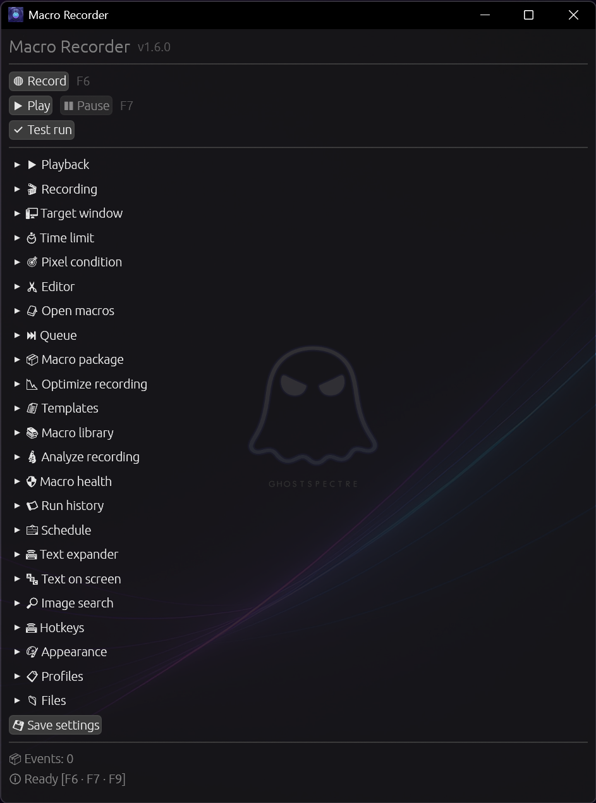
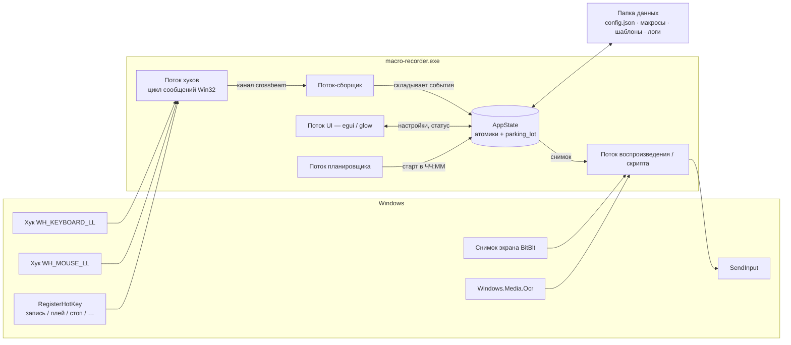
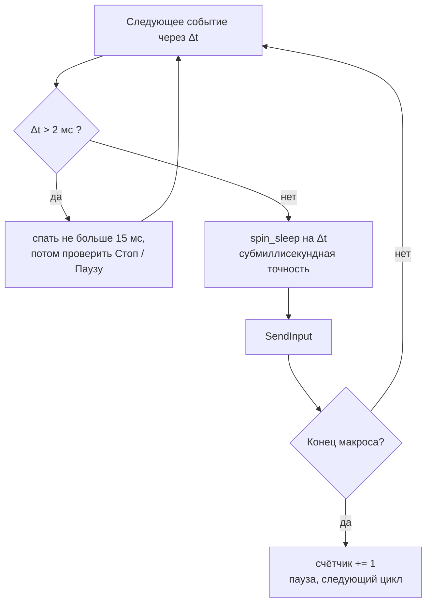
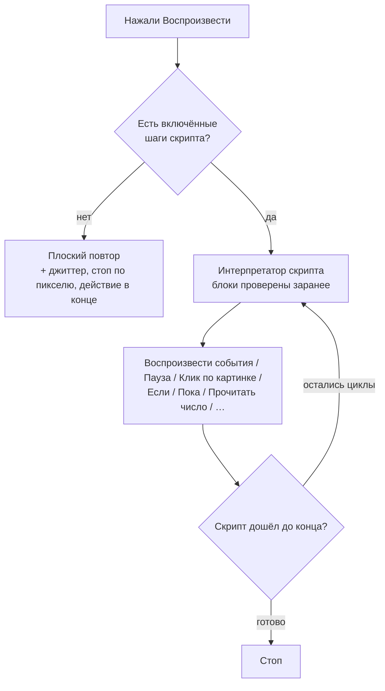
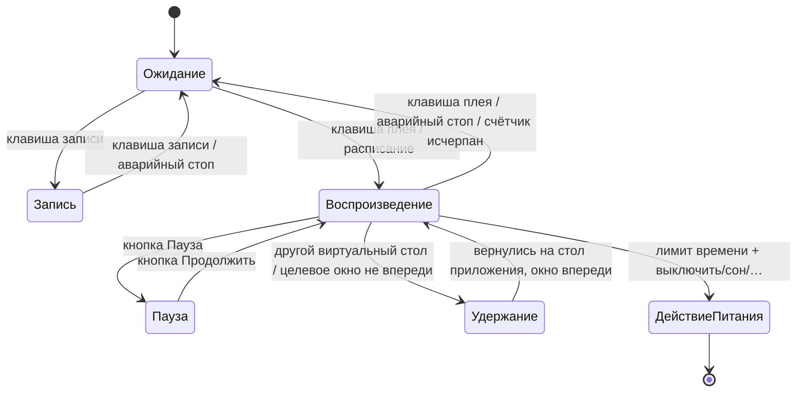

<div align="center">


# 🦀 Macro Recorder

**Современная опенсорсная альтернатива TinyTask.**
*Рождён из гринда в Roblox. Выкован на Rust.*

[](LICENSE)
[]()
[]()
[]()
[](https://github.com/blackixxce12/macro-recorder/releases)

*Записал мышь и клавиатуру → повторяй вечно, ровно N раз или до таймера → или напиши маленькую программу, которая сама смотрит на экран и решает, что делать.* ☕

[📥 Скачать](../../releases) • [✨ Возможности](#-возможности) • [🧠 Скрипты](SCRIPTS_RU.md) • [🆚 vs TinyTask](#-macro-recorder-vs-tinytask) • [🇬🇧 English version](README.md)



</div>

---

## 🆕 Коротко о главном

| | |
|---|---|
| 📖 **Встроенный справочник** | Сорок шесть статей о каждой панели, каждой кнопке и каждой идее, на которой держится программа. **F1** где угодно или **?** в углу — и откроется на том разделе, который у вас был открыт |
| ✅ **Он говорит «нет» до старта** | Любой запуск — кнопка, горячая клавиша, планировщик, `--no-gui` — сначала проходит предзапусковую проверку. Пропавшая картинка или `Call`, ведущий в никуда, останавливают прогон **до первого клика**, а не на середине ночи. `--check` выдаёт тот же вердикт кодом возврата |
| 🔍 **Почему шаг сделал именно это?** | Весь каскад по порядку, с числом, решившим каждую ступень: `✖ UI Automation` → `✖ Картинка 0.61 / 0.85` → `✔ Точка в окне`, и *записано 812, 641 → фактически 794, 655*. Программа всегда это вычисляла — теперь она это хранит |
| 🖥 **Где велась запись** | Размер экрана, масштаб, монитор, приложение впереди, раскладка — отмечаются в момент записи и сравниваются с этой машиной в момент запуска. `150 % → сейчас 100 %` — это и есть ответ на «почему он сегодня жмёт на двадцать пикселей ниже» |
| 📸 **Запись сразу в картинки** | Одна галочка — и каждый клик сохраняет небольшой квадрат экрана. Останавливаете запись, и программа предлагает превратить эти клики в шаги, которые найдут кнопку **там, куда она переехала**, не тронув нажатия клавиш и паузы между ними |
| ⚠️ **Шаг, который ничего не нашёл, теперь может сказать об этом** | Идти дальше, остановить скрипт, выйти из цикла или повторить *N* раз. До 1.5.0 был только первый вариант — так ночной макрос и оказывается кликающим в пустой рабочий стол до утра |
| 🧠 **Движок скриптов** | 24 вида шагов с `Если` / `Пока` / `Прервать`, переменные с числами **или текстом**, восемь условий, которые смотрят на экран, и **`Вызвать макрос`** для переиспользования. **[Полное руководство → SCRIPTS_RU.md](SCRIPTS_RU.md)** |
| 🔎 **Поиск по картинке** | Вырезал кусок экрана через `Win+Shift+S` — и макрос ждёт эту картинку или кликает по ней, где бы она ни появилась; теперь ему можно сказать, **где** искать, и захват экрана стоит **0.12 мс вместо 6** |
| 🔬 **Смотреть, как он думает** | Окно со всеми переменными по ходу прогона и **пауза перед каждым шагом** |
| 🪟 **UI Automation** | Спросить у Windows кнопку по имени: ни порога, ни разрешения, ни темы. 9.5 мс — и полное молчание там, где интерфейс рисуют сами |
| 🔤 **Текст на экране (OCR)** | Использует распознавание, уже встроенное в Windows: пять профилей обработки, ожидаемый формат и оценка соответствия |
| 📅 **Расписание** | Запуск в заданное время по выбранным дням недели — даже когда окно свёрнуто в трей |
| 🪟 **Целевое окно** | Автопауза, пока игра или программа не на переднем плане |
| 🖱 **Человеческое движение** | Курсор едет по дуге со случайным изгибом, плюс разброс прицела в пикселях |
| ✂ **Встроенный редактор** | Список действий человеческим языком, сырые события и инспектор каждого действия — с отменой |
| ⚙ **Сборка в отдельный .exe** | Самозапускающийся плеер — вместе со скриптом. Компилятор не нужен |
| ⚓ **Привязка к окну** | Следует за целевым окном, если оно переехало *или изменило размер* |
| ⌨ **Скорость на лету** | Горячие клавиши «быстрее / медленнее / пропустить шаг» прямо во время прогона |
| 👁 **Видно, куда он смотрит** | Прозрачное окно поверх всего рисует область поиска, найденное совпадение и его оценку |

<details>
<summary>Что внутри</summary>

Пауза и продолжение с честными часами расписания · 7 переназначаемых горячих клавиш + аварийный стоп ·
запись X1/X2 · диалоги открытия/сохранения и недавние файлы · сжатые макросы `.mrz` ·
выключение/перезагрузка/сон/гибернация/выход из системы · безоконный CLI с предзапусковой проверкой · тема Fluent (Mica) ·
9 тем · 6 языков · джиттер таймингов · единственный экземпляр · ротация логов ·
изоляция виртуальных рабочих столов · честный per-monitor DPI.

</details>

---

## 📑 Содержание

- [История](#-история-roblox-аниме-тавер-дефенсы-и-уставшая-рука)
- [Почему Rust](#-почему-rust)
- [Macro Recorder vs TinyTask](#-macro-recorder-vs-tinytask)
- [Возможности](#-возможности)
- [Как это работает](#-как-это-работает)
- [Горячие клавиши](#️-горячие-клавиши)
- [Скрипты](#-скрипты)
- [Поиск по картинке](#-поиск-по-картинке)
- [UI Automation](#-ui-automation)
- [Текст на экране (OCR)](#-текст-на-экране-ocr)
- [Редактор](#-редактор)
- [До и после прогона](#-до-и-после-прогона)
- [Справочник](#-справочник)
- [Расписание и целевое окно](#-расписание-и-целевое-окно)
- [Экспорт и прочее](#-экспорт-и-прочее)
- [Темы](#-темы)
- [Языки](#-языки)
- [Файлы и папки](#-файлы-и-папки)
- [Командная строка](#-командная-строка)
- [Скачать](#-скачать)
- [Сборка из исходников](#️-сборка-из-исходников)
- [Известные ограничения](#️-известные-ограничения)
- [FAQ](#-faq)
- [Лицензия и благодарности](#-лицензия-и-благодарности)

---

## 📖 История: Roblox, аниме тавер-дефенсы и уставшая рука

Я много играю в **Roblox** — особенно в аниме тавер-дефенсы. Кто играл, тот знает *этот цикл*:

> Поставил юнитов → дождался волны → собрал гемы → апнул → повторил.
> И ещё раз. И ещё. **Сотни раз за сессию.**

Однажды вечером, на третьем часу ручного тыканья в одни и те же кнопки «призвать / улучшить / забрать», рука сказала *«нет»*. И я сделал то же, что делают все — скачал **TinyTask**.

И честно? **Он работал.** TinyTask — правда отличная программа: 36 КБ рукописного C, которые тихо автоматизируют людям работу со времён Windows XP. Это образец минимализма, и без него этого проекта бы не было.

Но у минимализма две стороны. За несколько вечеров фарма я упёрся в одни и те же стены:

- ⏰ **Нет «остановись через N часов»** — я хотел фармить во сне и чтобы ПК потом сам выключился. TinyTask умеет крутить вечно или N раз, но про *время* не знает ничего;
- 🖥️ **Абсолютные пиксельные координаты без учёта DPI** — поменял масштаб Windows со 100% на 125%, воткнул ноутбук в док или перетащил игру на другой монитор — и все клики мимо;
- 🔒 **Закрытый исходник** — программу, которая ставит глобальные хуки на клавиатуру и шлёт синтетический ввод в мою систему, хотелось бы иметь возможность *прочитать*;
- 🧾 **Бинарные `.rec`** — я хотел править макрос в текстовом редакторе, а не перезаписывать;
- 🌍 **Нет русского / украинского / китайского интерфейса**;
- 🎨 **Панель из 2007 года** — мило, но я смотрю в это окно часами.

Так появился инструмент, который я хотел. А потом выяснилась вторая стена: **слепая запись — глупая.** Если волна идёт на 4 секунды дольше обычного, фиксированный повтор кликает в пустоту, и весь прогон впустую. Нужно было не «кликни через 12 секунд», а *«дождись, когда появится кнопка Claim, и нажми её»*.

Ради этого и сделан [движок скриптов](SCRIPTS_RU.md). Теперь макрос умеет смотреть на экран — искать картинку, цвет пикселя, окно или слово текста — и решать, что делать дальше. При этом он остаётся в первую очередь рекордером: скучное вы записываете, а условия навешиваете сверху только там, где без них никак.

Проект выходного дня слегка вышел из-под контроля. 🦀

---

## 🦀 Почему Rust?

| Причина | Что это даёт вам |
|---|---|
| **Один .exe** | Ни установщика, ни .NET, ни Python — один файл, двойной клик, готово |
| **Бесстрашная многопоточность** | Параллельно работают пять ролей — низкоуровневые хуки, сборщик событий, микросекундный движок повтора, планировщик и GPU-интерфейс — и компилятор гарантирует, что они не портят состояние друг друга |
| **Безопасность памяти** | Программа, которая шлёт ввод в систему, не должна затирать буфер событий посреди рейда. За пределами тонкого `unsafe`-слоя Win32 FFI Rust делает целые классы багов невозможными |
| **Маленький и быстрый** | С `opt-level = 3` + LTO + `strip` приложение — это один файл на ~10 МБ, и стартует мгновенно |
| **Честная причина** | Хотелось нормального повода выучить Rust. Лучший способ — сделать то, чем сам пользуешься |

---

## 🆚 Macro Recorder vs TinyTask

> **Таблица сверена** с официальным сайтом TinyTask, его changelog, FAQ и страницей поддержки (см. [Источники](#источники-по-колонке-tinytask)). TinyTask — *не* плохая программа, а намеренно минималистичная. Где он выигрывает, там так и написано.

### Что выбрать

| Берите **TinyTask**, если… | Берите **Macro Recorder**, если… |
|---|---|
| Нужен минимальный размер (36 КБ) | Нужны таймер, пауза/продолжение и действия с питанием |
| Нужна работа на Windows XP / Vista / 7 | У вас Windows 10 / 11 с масштабированием или несколькими мониторами |
| Нужен инструмент на 36 КБ, который ещё и собирает макросы в 60-килобайтные exe (у нас — ~10 МБ) | Нужен макрос, который реагирует на экран, а не кликает вслепую |
| Нужна программа, проверенная больше десятка лет | Нужен открытый код, который можно проверить, форкнуть и доработать |
| Нужно только «записал → воспроизвёл» | Нужны редактор, условия, поиск по картинке, OCR и расписание |

### Полное сравнение

| | **TinyTask 1.77** | **Macro Recorder** |
|---|---|---|
| **Лицензия** | Freeware, **закрытый исходник** | **MIT, полностью открытый** |
| **Реализация** | Чистый C + голый Win32, самодостаточный **32-битный** exe | Rust 2024 + `windows-rs`, **64-битный** exe |
| **Размер бинарника** | **~36 КБ** 🏆 | ≈10 МБ (GPU-интерфейс, 9 тем, 6 переводов, зрение + OCR, четыре SIMD-ядра) |
| **Установка** | Портативный exe (опционально установщик Inno Setup) | Портативный exe |
| **Поддержка Windows** | **XP → 11** 🏆 | 10 / 11 (Windows 11 для Mica/Acrylic и виртуальных столов) |
| **Интерфейс** | Фиксированная панель Win32, сменные битмапы | GPU-рендер `egui`, **9 тем**, переключение на лету |
| **Прозрачность окна** | ❌ | ✅ попиксельная альфа + **DWM Mica / Acrylic** |
| **Языки интерфейса** | Отдельные **локализованные сборки** (FR, DE, IT, PT, ES, SV) с v1.74 — без переключателя | **6 языков прямо в программе** (EN, RU, UK, PT, ES, ZH) + автоопределение |
| **Захват клавиатуры** | ✅ | ✅ виртуальная клавиша **+ скан-код + флаг extended** |
| **Движение и клики мыши** | ✅ | ✅ (ЛКМ / ПКМ / СКМ) |
| **Колесо мыши** | ⚠️ по документации не работает с частью мышей | ✅ **вертикальное и горизонтальное** |
| **Боковые кнопки X1 / X2** | ❌ | ✅ пишутся и воспроизводятся |
| **Игнорирует собственный ввод** | не задокументировано | ✅ фильтрует `LLKHF_INJECTED` / `LLMHF_INJECTED` |
| **Горячие клавиши не попадают в запись** | ✅ by design | ✅ |
| **Повтор** | ✅ бесконечно **или** N раз | ✅ бесконечно **или** N раз (1–9999) |
| **Пауза между циклами** | ❌ (вшивайте в запись) | ✅ 0–600 000 мс |
| **Пауза / продолжение** | ❌ | ✅ без потери позиции |
| **Остановка по таймеру** | ❌ | ✅ **часы : минуты : секунды** |
| **Действие по достижении лимита** | ❌ | ✅ стоп · **выключить · перезагрузить · сон · гибернация · выйти из системы** |
| **Скорость воспроизведения** | ✅ пресеты (½×, 1×, 2×, 100×) + своё значение | ✅ ползунок **0.1× – 3.0×**, **меняется на лету горячей клавишей** |
| **Джиттер таймингов** | ❌ | ✅ опционально 0–50 % на событие |
| **Человеческие траектории курсора** | ❌ | ✅ дуги Безье + разброс прицела в пикселях |
| **Таймер во время записи** | ❌ (обратный отсчёт при проигрывании с v1.61) | ✅ живой таймер записи + итоговая длительность |
| **Счётчик проигрываний** | ❌ | ✅ `проигрываний: 7 / 50` в окне |
| **Глобальные горячие клавиши** | `Ctrl+Alt+Shift+R` / `Ctrl+Shift+Alt+P`, пара альтернатив в настройках | ✅ **7 переназначаемых слотов** (любая клавиша × Ctrl/Alt/Shift), без перезапуска |
| **Аварийный стоп** | ✅ Break / ScrollLock / Pause | ✅ **F9** по умолчанию, переназначается |
| **Поверх всех окон** | ✅ (с v1.61) | ✅ переключается на лету |
| **Сохранение настроек** | ✅ портативный `.ini` (с v1.50) | ✅ читаемый **`config.json`** + автосохранение при выходе |
| **Формат макроса** | Проприетарный бинарный `.rec` | **Обычный JSON** с микросекундными метками, опционально gzip (`.mrz`) |
| **Правка записи** | ❌ в классической сборке (на сайте есть отдельная «With Editor») | ✅ **встроенный редактор** (3 вида + инспектор) + любой текстовый редактор |
| **Диалоги открыть/сохранить, недавние** | ✅ открыть и сохранить | ✅ + список недавних |
| **Сборка макроса → отдельный .exe** | ✅ на выходе ~60 КБ 🏆 | ✅ на выходе ~10 МБ (копия этого exe + макрос **и его скрипт**) |
| **Экспорт в другой инструмент** | ❌ | ✅ **скрипт AutoHotkey v2** (только события) |
| **Значок в трее / сворачивание** | ❌ | ✅ с меню запись / плей / стоп |
| **Привязка к окну** | ❌ | ✅ следует за окном, если оно переехало **или изменило размер** |
| **Остановка по пикселю экрана** | ❌ | ✅ цвет + допуск, с пипеткой |
| **Скрипты / условная логика** | ❌ | ✅ **24 вида шагов, `Если`/`Пока`/`Прервать`, переменные с числами или текстом и `Вызвать макрос`** — [SCRIPTS_RU.md](SCRIPTS_RU.md) |
| **Распознавание картинок** | ❌ | ✅ нормализованная кросс-корреляция с маской, опционально несколько масштабов |
| **Распознавание текста (OCR)** | ❌ | ✅ через `Windows.Media.Ocr` — ничего скачивать не надо |
| **Планировщик (запуск по времени)** | ❌ | ✅ время + дни недели, работает из трея |
| **Пауза, пока впереди чужое окно** | ❌ | ✅ по заголовку окна |
| **Профили настроек** | ❌ | ✅ именованные, без ограничений |
| **Свои переводы без пересборки** | ❌ | ✅ подмена через `lang/xx.json` |
| **Запуск без окна / из скриптов** | ❌ (для этого есть собранный exe) | ✅ `--play … --loops … --no-gui` |
| **Защита от второго экземпляра** | ❌ | ✅ фокусирует уже открытое окно |
| **Честный per-monitor DPI** | ❌ сырые пиксели; смена масштаба сдвигает все клики | ✅ **Per-Monitor v2** + координаты по всему виртуальному рабочему столу |
| **Относительный режим мыши** | ❌ | ✅ переключатель — полезно для камеры в шутерах |
| **Изоляция виртуальных столов (Win 11)** | ❌ | ✅ запись и воспроизведение встают на паузу, если приложение не на активном столе |
| **Модель таймингов** | Точный повтор записанных задержек | Микросекундные метки + `timeBeginPeriod(1)` + гибридный sleep / spin-sleep |
| **Файл логов** | ❌ | ✅ ротация по дням |
| **Ложные срабатывания антивирусов** | ⚠️ давняя известная проблема | ⚠️ то же самое — любой инжектор ввода выглядит подозрительно |
| **Цена** | Бесплатно | **Бесплатно навсегда** |

### В чём TinyTask всё ещё лучше 🏆

Отдадим должное — две вещи, которые этот проект не может:

1. **Размер и охват.** 36 КБ, 32 бита, работает на Windows XP. Его собранные макросы — ~60 КБ;
   наши — копия этого исполняемого файла на ~10 МБ, потому что плеер *и есть* всё приложение.
   Если надо отправить макрос человеку на старой машине — TinyTask выигрывает вчистую.
2. **Десятилетие полевых испытаний.** TinyTask годами используют огромное число людей.
   Macro Recorder молод — пожалуйста, [пишите issues](../../issues).

### Источники по колонке TinyTask

Факты взяты с официального сайта TinyTask, а не с SEO-зеркал (часть из которых противоречит и друг другу, и changelog самого разработчика):

- Официальный changelog — <https://www.tinytask.net/revision_history.html>
- Официальный FAQ — <https://www.tinytask.net/faq.html>
- Официальная страница поддержки (горячие клавиши, аварийный стоп) — <https://www.tinytask.net/support.html>
- Официальные загрузки (v1.77, сборки «With Editor») — <https://www.tinytask.net/download.html>
- Карточка в The Portable Freeware Collection — <https://www.portablefreeware.com/index.php?id=1853>

---

## ✨ Возможности

**Запись**

- 🔴 Движения мыши, клики, колесо (вертикальное *и* горизонтальное), **боковые X1/X2** и вся клавиатура — со скан-кодами и extended-клавишами, поэтому раскладки и NumPad ведут себя правильно
- 🎚 Шаг выборки движений настраивается (1–100 мс, по умолчанию 5 мс) или **отключается совсем** для макросов из одних кликов
- 🚫 Рекордер игнорирует и собственный синтетический ввод, и ваши горячие клавиши — ни то, ни другое в макрос не попадёт

**Воспроизведение**

- ▶ Микросекундное расписание: системный таймер 1 мс плюс гибридный цикл sleep/spin-sleep, поэтому длинные макросы не «уплывают»
- 🔁 Бесконечно, **ровно N раз** (1–9999) или **до лимита времени**, с паузой между циклами
- ⏸ **Пауза и продолжение** — часы расписания встают вместе с вами, поэтому после паузы ничего не «отматывается» разом
- ⚡ Скорость **0.1× – 3.0×** (плюс горячие клавиши «быстрее»/«медленнее» на лету) и опциональный **джиттер** (0–50 %)
- 🖱 Абсолютная или относительная мышь, опциональное **человеческое движение по дуге** и разброс прицела
- 🎛 **Профили воспроизведения** — «Рабочий стол», «Игра», «Как человек»: названия для тех сочетаний настроек выше, которые действительно идут вместе
- 🛟 Стоп всегда отпускает всё, что макрос удерживал — никакого залипшего Shift или зажатой кнопки мыши

**Решать, а не просто повторять**

- 🧠 **[Скрипт](SCRIPTS_RU.md)** умеет ждать, ветвиться, крутить циклы и считать — и при этом воспроизводить куски вашей записи
- 🔎 **Поиск по картинке**: найти кнопку где угодно на экране и кликнуть по ней, даже если вёрстка съехала
- 🔤 **OCR**: реагировать на слово на экране или считать число (гемы, таймер, HP) в переменную
- 🎯 **Условие по пикселю**: следить за одной точкой и остановиться — или выключить ПК — когда она изменилась

**Собирать, почти не собирая** *(новое в 1.6.0)*

- ✅ **Множественный выбор** — Ctrl+клик и Shift+клик, затем дублировать, удалить, включить, отключить или **обернуть в Если / Повтор / Группу** одним нажатием
- 📁 **Группа** — имя для набора шагов, никак не влияющее на выполнение. Список из сорока шагов читается как шесть вещей
- 🧩 **Двенадцать шаблонов** — дождаться кнопки и нажать, разобраться со всплывающим окном, войти, попробовать-и-восстановиться, фармить до счётчика, работать до времени и другие. Вставляются как обычные шаги и правятся как любые другие
- 📚 **Библиотека макросов** — все макросы из вашей папки `macros/`, вставляемые в текущий как вызов
- 🧹 **Оптимизация записи** — убирает дрожание руки, автоповтор, путь к месту работы и простои дольше двух секунд. **Показывает, что именно уберёт, до того как что-то убрать**
- 💬 **Шаги управления потоком читаются по-человечески** — «Повторять, пока», «Сделать, если», «Иначе», «Прервать цикл». Модель под ними та же; ни один существующий макрос не изменился

**Пережить ночь** *(новое в 1.6.0)*

- 🩹 **Блоки восстановления** — пятый ответ на «а если этого нет»: выполнить именованный блок шагов и попробовать ещё раз. Повторять попытку правильно, когда нужного просто ещё не появилось; и бесполезно, когда что-то *мешает*, — а это разбирается с помехой
- 📈 **Статистика шагов** — сколько раз каждый шаг выполнялся, как часто срабатывал, среднее и самое долгое время; хранится за самим шагом, а не за его позицией
- ⌛ **Адаптивные ожидания** — ждать столько, сколько этому шагу обычно нужно, по истории запусков, а ваше число остаётся потолком
- 🪟 **Действия с окном** — вывести вперёд, свернуть, развернуть, восстановить, переместить, изменить размер, по центру, закрыть, а также подождать, пока окно окажется впереди, появится или закроется. Один шаг, один список
- 🎯 **Целевое окно по программе, а не только по заголовку** — `roblox` находит `RobloxPlayerBeta.exe`, и окно ищется заново, если игра перезапустилась
- 📋 **Буфер обмена как шаг**, включая **дождаться изменения** — именно так макрос узнаёт, что копирование произошло, а не угадывает задержку
- 🔤 **Девять встроенных значений** — `{clipboard}`, `{window.title}`, `{time}`, `{mouse.x}` и остальные, в любом текстовом поле
- 🔔 **Уведомление** из трея и 📷 **снимок экрана** в файл

**Записывать намерение, а не координаты** *(новое в 1.6.0)*

- 🎯 **Цели** — один шаг говорит, *что* нажать; программа несёт все способы это найти, которые были доступны в момент записи, и пробует их по порядку: элемент интерфейса → картинка → текст → относительно окна → координата. Кнопка переехала, тема сменилась, окно открыли в другом месте — шаг всё равно работает
- 🎚 **Надёжность: Максимальная · Сбалансированная · Быстрая** — весь интерфейс к этому каскаду. Вы выбираете слово, а не порядок способов
- 🔬 **Разбор записи** — после записи таблица того, чем каждый клик является сейчас и чем мог бы быть, с галочкой в каждой строке. «Применить» переписывает скрипт
- 🧠 **Запись запоминает, по чему кликнули** — окно, процесс, прямоугольник окна и элемент интерфейса под курсором, всё в тот единственный момент, когда это бесплатно
- 🔖 **Метки** — имя для места в записи, чтобы `Проиграть события 73…184` перестало означать каждый раз что-то другое после правок

**Прогнать, проверить, разобраться** *(новое в 1.6.0)*

- 🧪 **Проверочный прогон** — проиграть весь макрос, ничего не отправляя. Картинки всё так же ищутся, текст читается, переменные считаются; каждый клик и нажатие считаются вместо отправки, а два шага, выходящих за пределы очереди ввода, пропускаются
- 🖼 **Снимок экрана и объяснение, когда шаг сдаётся** — `лучшее совпадение для «claim» набрало 0.41, а шаг требует 0.85`, и что попробовать дальше. Ни модели, ни сети: все числа в этой фразе уже были известны
- 📜 **История запусков** — что происходило в последние двадцать раз, новые сверху, со снимком экрана
- 🛡 **Состояние макроса** — проверить, не запуская: пропавшие картинки, диапазоны `Проиграть события`, которые больше не подходят к записи, циклы без выхода, фиксированные координаты, плюс оценка надёжности и понятный список того, что этот макрос умеет
- ⌨ **Ctrl+K** — введите часть названия, получите команду

**Автоматизация и безопасность**

- ⏱ Лимит времени `Ч : М : С`, затем: остановить · выключить · перезагрузить · сон · гибернация · выйти из системы
- ⏳ Выключение/перезагрузка идут с видимым отсчётом (0–600 с, по умолчанию 60) — `shutdown /a` его отменяет
- 📅 **Расписание** — старт в `ЧЧ:ММ` по отмеченным дням недели, даже из трея
- 🪟 **Целевое окно** — автопауза, пока впереди не ваша игра
- 🧭 **Честный per-monitor DPI (v2)** — Windows отдаёт настоящие физические пиксели, поэтому масштаб 125%/150% не сдвигает клики
- 🪟 **Изоляция виртуальных столов (Windows 11)** — если приложение живёт на Столе 2, оно не пишет и не проигрывает, пока вы работаете на Столе 1
- 🔒 **Один экземпляр** — второй запуск просто фокусирует уже открытое окно

**Интерфейс и файлы**

- ⌨ 7 переназначаемых глобальных горячих клавиш, включая отдельный **аварийный стоп** (по умолчанию `F6` / `F7` / `F8` / `F9`)
- 📌 Переключатель «Поверх всех окон»
- 🎨 **9 тем** + прозрачный интерфейс, с подложками Windows 11 **Mica** и **Acrylic** (на Windows 10 — обычное размытие)
- 🌍 **6 языков**, автоопределение и переключение на лету
- 📦 Макросы как обычный JSON — или сжатый `.mrz`, когда важен размер — с диалогами и списком недавних
- 💾 Настройки в читаемом `config.json`, сохраняются по кнопке и при выходе
- 📝 Ротируемый лог на каждый день — на случай, если что-то ведёт себя странно
- 🖥 Безоконный CLI для скриптов и планировщика задач

---

## 🧠 Как это работает

### Архитектура



Ничто не блокирует интерфейс, и ничто не блокирует колбэк хука — зависший низкоуровневый хук Windows молча отключает. Поэтому колбэк делает абсолютный минимум: две атомарные загрузки, кешированный хэндл окна, кешированный ответ про виртуальный стол — и отдаёт событие в lock-free канал.

### Планировщик воспроизведения

Наивные циклы на `sleep()` за двухчасовой макрос уползают далеко, а один длинный `sleep()` делает клавишу Стоп «сломанной». Движок планирует каждое событие по одним монотонным часам и никогда не спит дольше ~15 мс за раз:



`timeBeginPeriod(1)` запрашивается только на время воспроизведения и освобождается после, чтобы приложение не держало всю систему на высокоточном таймере просто так.

### Два режима воспроизведения

Макрос **без скрипта** проигрывается «плоско»: событие за событием, по записанным таймингам. Макрос **со скриптом** отдаёт управление интерпретатору, а запись превращается в библиотеку кусков, которые скрипт может воспроизводить (`Воспроизвести события 0…240`).



### Диаграмма состояний



Вход в **Паузу** или **Удержание** отпускает всё, что макрос удерживал, и замораживает часы расписания — поэтому возврат через десять минут продолжает ровно с того места, а не проигрывает десять минут задолженности на полной скорости.

---

## ⌨️ Горячие клавиши

| Действие | По умолчанию | Примечания |
|---|---|---|
| Старт / стоп **записи** | `F6` | Переназначается |
| Старт / стоп **воспроизведения** | `F7` | Переназначается |
| **Пауза / продолжить** | `F8` | Переназначается, есть и кнопка в окне |
| **Аварийный стоп** | `F9` | Останавливает и запись, *и* воспроизведение |
| **Быстрее** | не задана | ×1.25 к скорости, применяется мгновенно |
| **Медленнее** | не задана | ×0.8 к скорости, применяется мгновенно |
| **Пропустить шаг** | не задана | Бросает текущий шаг (или остаток текущего `Воспроизвести события`) |

Все слоты регистрируются глобально с `MOD_NOREPEAT`, поэтому работают, когда фокус в любом приложении, и отфильтровываются из записи. К каждой можно добавить **Ctrl**, **Alt** и **Shift**, изменения применяются сразу — без перезапуска.

Нажмите кнопку **Задать** и нажмите что угодно — буквы, цифры, функциональные клавиши. На время привязки глобальные клавиши отпускаются, так что можно даже поменять местами `F6` и `F7`; Esc или 15 секунд тишины отменяют. Список ▾ рядом покрывает клавиши, которые окно никогда не получает: `Pause`, `ScrollLock` и NumPad. **Сбросить** очищает слот.

> Если комбинацию уже занял другой процесс, программа скажет об этом в разделе **⌨ Горячие клавиши**, а не промолчит — выберите другую клавишу или добавьте модификатор.

---

## 🧠 Скрипты

Запись повторяет то, что вы сделали. **Скрипт** решает, *нужно ли* это делать и *сколько раз*.

```
0  Пока  gems < 500
1      Ждать  картинка: claim_button ≥ 0.85  появится  (10000 мс)
2      Клик по картинке: claim_button ≥ 0.85
3      Воспроизвести события 0…240  (241/241)
4      Прочитать число (1620,40 300x80) → gems
5  Конец пока
6  Закрыть программу
```

Шаги лежат внутри файла макроса, поэтому макрос со скриптом — это по-прежнему один `.json`, который можно сохранить, передать другу и собрать в `.exe`.

**24 вида шагов:** `Воспроизвести события` · `Пауза` · `Ждать` · `Клик по картинке` · `Найти картинку` · `Клик в` · `Клавиша` · `Присвоить` · `Если` · `Иначе` · `Конец если` · `Пока` · `Конец пока` · `Прервать` · `Запустить` · `Закрыть программу` · `Заметка` · `Прочитать число` · `Прочитать текст` · `Взять текст` · `Записать текст` · `Найти элемент` · `Нажать элемент` · **`Вызвать макрос`**

**8 условий:** `всегда` · `переменная` · `картинка` · `пиксель` · `окно` · `текст` · `процесс запущен` · `элемент на экране`

> 📘 **Полное пошаговое руководство — в [SCRIPTS_RU.md](SCRIPTS_RU.md)**: каждый вид шага, каждое условие, встроенные переменные, три разобранных примера и таблица «что делать, если не работает». Начинайте оттуда; этот раздел — только краткая сводка.

Откройте редактор (**✂ Редактор → Открыть редактор**), перейдите на вкладку **Скрипт**, выберите вид шага в списке и нажмите **Добавить**. Блоки проверяются до запуска: незакрытый `Если` показывается прямо в редакторе, и такой скрипт не запустится вовсе, вместо того чтобы выполниться наполовину.

---

## 🔎 Поиск по картинке

Раздел **🔎 Поиск по картинке** в главном окне.

1. Вырежьте нужную кнопку через `Win+Shift+S` и нажмите **📋 Вставить**. (Или **📂 Открыть PNG…**.)
2. Нажмите **🔍 Найти на экране**. Ответ будет вида `Найдено в (x, y) — 0.973` или `Не найдено (лучшее 0.412)`.
3. Нажмите **💾 Сохранить PNG…** в папку `templates/` — скрипты ссылаются на шаблоны **по имени файла**.

**Порог совпадения** (0.30–1.00, по умолчанию 0.85) — это нормализованная кросс-корреляция: `1.00` — попиксельно идентично, `0.85` прощает сглаживание и небольшой сдвиг цвета. Оценка нормализована, поэтому шаблон продолжает совпадать, даже если в игре изменилась яркость или тема.

Полностью прозрачные пиксели PNG **не участвуют в оценке** — вырежьте круглую иконку из фона в любом редакторе, и она будет находиться на любой подложке.

| Опция | Что делает |
|---|---|
| **Пробовать другие масштабы** | Дополнительно проверяет 0.8×, 0.9×, 1.1×, 1.25× — если окно теперь другого размера |
| **Искать только в области** | Ограничивает поиск прямоугольником |
| **Показывать, куда смотрит скрипт** | Открывает прозрачный оверлей, описанный ниже |

> ⚠️ **«Пробовать другие масштабы» работает только для кнопки проверки** — поиск в скрипте всегда идёт в масштабе 1.0×. Ответ на другой экран — файл-спутник ниже, а не перебор масштабов.

Поиск идёт в отдельном потоке, окно не подвисает; полное сканирование экрана занимает мгновение и показывает крутилку.

### Сказать скрипту, где искать

У каждого шага и каждого условия с картинкой есть собственная **область поиска**: весь экран, активное окно, заданный прямоугольник, рядом с прошлым совпадением или относительно другой картинки. Это самое полезное поле выпуска. Замерено на столе 2560×1440 через `--selftest vision`, один шаг, ищущий шаблон 64×64:

| Область | Снимок | Поиск | Итого | Просмотров в секунду |
|---|---|---|---|---|
| 2560×1440 | 10.4 мс | 22.0 мс | 32.4 мс | 31 |
| 1280×720 | 3.3 мс | 6.6 мс | 9.9 мс | 101 |
| 400×300 | 0.6 мс | 1.2 мс | 1.7 мс | 584 |
| 200×150 | 0.1 мс | 0.5 мс | 0.6 мс | 1582 |

**Относительно другой картинки** — то, чего не заменит никакой порог. Ряд одинаковых кнопок одинаков; какую нажать, решает заголовок над ней, и якорь — это способ сказать об этом скрипту.

Столбец «снимок» — это то, что изменила версия 1.5.0, и изменение теперь больше самого поиска. См. [Почему снимок экрана подешевел в двадцать раз](#почему-снимок-экрана-подешевел-в-двадцать-раз).

### Что делать, если картинки нет

У каждого шага, который что-то ищет, появилось ещё одно поле: **если не найдено**.

| Ответ | Для чего |
|---|---|
| **Идти дальше** | Опрос внутри `Пока`. То, что делали все версии до 1.5.0, всегда — и по-прежнему значение по умолчанию, так что ничего из уже написанного не изменилось. |
| **Остановить скрипт** | Всё остальное. Макрос, который потерял почву под ногами, должен останавливаться, а не продолжать. |
| **Выйти из цикла** | Цикл, который ждёт одно из нескольких событий. |
| **Повторить *N* раз** | Интерфейс, который ещё дорисовывается. Ждёт между попытками и останавливает прогон, если так и не нашёл: повтор, который тихо сдаётся, — это и есть та ловушка, ради которой поле появилось. |

Шаг с чем угодно, кроме «идти дальше», показывает это прямо в списке шагов, так что места, где прогон может закончиться, видны без открытия каждого шага.

### Запись сразу в шаги по картинке

В разделе **🎬 Запись** отметьте **Вырезать картинку на каждом клике**. С этого момента
запись сохраняет квадрат экрана (по умолчанию 64 px, от 16 до 512) вокруг каждого
клика. Когда вы нажимаете «Стоп», программа предлагает превратить эти клики в шаги
`Клик по картинке`.

Соглашаетесь — и каждый квадрат записывается в `templates/` как `rec_<дата>_<nn>.png`
вместе с DPI-спутником, а макрос переписывается в скрипт. Всё, что было между одним
превращённым кликом и следующим, остаётся шагом `Воспроизвести события` ровно на этот
диапазон, так что нажатия клавиш, прокрутка и записанные паузы сохраняются — картинками
становятся только клики.

Две вещи, которых он намеренно не делает:

- **Перетаскивание не трогается.** Нажать, провести, отпустить — это не клик, который
  может заменить картинка, поэтому оно остаётся внутри своего `Воспроизвести события`,
  где продолжает работать.
- **Сгенерированные шаги останавливают скрипт**, если картинка не нашлась, а не идут
  дальше. Шагу, который написала эта программа и который не может найти кнопку, из
  которой был вырезан, дальше делать нечего. Если вы не согласны — в диалоге есть
  выпадающий список.

Картинки — обычные PNG с машинными именами. Переименовать их во что-то осмысленное (и
поправить шаги) — нормальный следующий ход, а подрезать их плотнее в любом редакторе
обычно помогает.

### Когда картинка двигается, бледнеет или меняет тему

| Возможность | Зачем |
|---|---|
| **Два порога** | Оценка, скачущая около одного порога, читается как несколько смен состояния в секунду. Второй, более низкий порог «считать потерянным» превращает это в одну. |
| **Стабильно N из M** | Отличает объект (0.82, 0.84, 0.83) от мелькания (0.83, 0.51, 0.74). |
| **Папка вариантов** | `templates/Claim/` с `normal.png`, `hover.png`, `dark.png` — это один шаг, а не три. |
| **По контурам** | Сравнивает форму, а не оттенки: переживает смену темы и подсветку строки, примерно за 1.6× цены. |
| **Файл-спутник с масштабом** | При сохранении шаблона рядом пишется `Имя.png.json` с масштабом экрана, при загрузке шаблон пересчитывается под текущий экран. У шаблонов до 1.4.0 спутника нет, и их не трогают. |

### Почему снимок экрана подешевел в двадцать раз

Интересно здесь то, что очевидное объяснение оказалось неверным, и это показал замер.

Каждый взгляд на экран раньше создавал контекст устройства и битмап и уничтожал их
обратно, выделял и обнулял новый буфер, делал `BitBlt` в битмап, вытаскивал всё это
`GetDIBits` второй раз, а потом проходил по каждому пикселю, меняя местами красный с
синим. Всё это — настоящая работа, и всей её больше нет: DIB-секция означает, что
`BitBlt` пишет прямо в память, которую этот процесс может читать, контекст и битмап
живут между захватами, а `Frame` теперь сам несёт порядок своих байтов вместо того,
чтобы его переписывали ради маскировки. (Последнее отменяло само себя: `capture`
переворачивал BGRA в RGBA, а `upscale_to_bgra` переворачивал обратно по дороге к
движку OCR.)

Всё это вместе не изменило число вообще.

`--selftest vision` печатает разбивку под заголовком **Where a capture goes**:

| Область | `GetDC` | `BitBlt` с экрана | Тот же blit, память в память |
|---|---|---|---|
| 320×240 | 0.01 мс | 6.07 мс | 0.10 мс |
| 640×480 | 0.01 мс | 6.08 мс | 0.22 мс |
| 2560×1440 | 0.01 мс | 23.9 мс | 3.18 мс |

`BitBlt` из композитного рабочего стола стоит около шести миллисекунд *до того, как
скопирует хоть один полезный пиксель*. Приёмник никогда не был дорогой частью — таблица
сравнивает новую DIB-секцию с тем битмапом устройства, который она заменила, и они
выходят равными. Дорогой была обратная вычитка.

Поэтому 1.5.0 перестаёт спрашивать GDI. **Desktop Duplication** — это интерфейс, который
композитор предлагает ровно для этого: он отдаёт поверхность, которая у него уже есть,
на сторону процессора переезжает только запрошенный прямоугольник, а кадр, который не
изменился, вообще не присылается — так что скрипт, опрашивающий устоявшийся экран,
стоит одного копирования подпрямоугольника из уже лежащей текстуры.

| | GDI | Desktop Duplication |
|---|---|---|
| 400×300, 200 раз подряд | 6.06 мс каждый | **0.12 мс каждый** |
| Весь экран 2560×1440 | 30.2 мс | **4.0 мс** |
| Из этих 200 опросов — кадров, которые композитору не пришлось присылать | — | **196** |

Там, где это не работает, он сам, отдельно в каждом потоке, возвращается к старому пути:
старый графический стек, удалённый сеанс, повёрнутый монитор, прямоугольник на стыке
двух экранов или драйвер, который просто отказывает. Переключатель в разделе **🔎 Поиск
по картинке** выключает его для машины, где он работает плохо, а не совсем не работает.

**Та же ли это картинка?** Чтобы задать этот вопрос правильно, понадобилось три захода.
Сравнение двух захватов на равенство разваливается на любом экране, где есть что-то
живое: первая версия проверки отрапортовала, что изменилось 97 % кадра, — и это была
правда, потому что была запущена игра. Работает не подсчёт пикселей: вырезать шаблон из
кадра, снятого старым способом, и найти его в кадре, снятом новым. Перепутаны каналы —
корреляция рушится; проигнорирован row pitch — совпадение уезжает; не тот монитор —
промах на ширину экрана. `--selftest vision` прогоняет это каждый раз и печатает
**0 px мимо, score 1.000**.

### Увидеть, что он видит

**«Показывать, куда смотрит скрипт»** кладёт поверх всего прозрачное окно, сквозь которое проходят клики. Пока идёт скрипт, оно рисует область поиска синим, совпадение с оценкой — зелёным или красным, прямоугольник чтения текста — янтарным, найденный элемент интерфейса — фиолетовым.

Неудачный поиск выдаёт `0.41`, и `0.41` не скажет, смотрели ли не туда, не в том масштабе или на нужное место под подсказкой. Прямоугольник скажет. Это средство диагностики, по умолчанию выключено.

### Смотреть, что он знает

**«Следить за прогоном»** открывает второе окно со списком всех переменных и их
значений, обновляемым на каждом шаге, а также с тем, какой шаг сейчас выполнится и на
какой глубине вызовов он находится. Оверлей показывает, куда скрипт смотрит; это окно —
что он уже выяснил, и вдвоём они обычно объясняют сломавшийся макрос сами.

**«Пауза перед каждым шагом»** превращает прогон в пошаговый: он останавливается перед
каждым шагом и ждёт кнопки **▶ Следующий шаг**. «Стоп» работает и на паузе, и закрытие
окна тоже: прогон, который освобождает только одна кнопка, в программе, весь смысл
которой — глобальная клавиша остановки, был бы ловушкой.

---

## 🪟 UI Automation

Вместо того чтобы разглядывать пиксели, можно спросить у Windows, что на экране. Там, где это работает, оно превосходит всё остальное: элемент, найденный по имени, находится при любом разрешении, в любой теме, при любом размере окна и без подбора порога, а нажатие идёт через само приложение — курсор не двигается, и окну даже не обязательно быть активным.

Шаги **Найти элемент** и **Нажать элемент**, условие **Элемент на экране**. Элемент задаётся любым из: **Имя** (текст, который произнёс бы экранный диктор), **Id** (идентификатор, который даёт приложение) и **Тип** (`Button`, `Edit`, `Text`, `CheckBox`, …). Сужение по типу и держит скорость. Замерено по активному окну: от 9 до 35 мс на точное совпадение — в зависимости от того, сколько это окно выставляет наружу, — что быстрее любого поиска по картинке здесь; и в несколько раз дороже, когда имя приходится искать по вхождению.

> ⚠️ **Он видит только то, что приложение само выставляет наружу.** Unity, DirectX, OpenGL и интерфейсы на canvas не выставляют ничего, а между процессами разных привилегий он ограничен или молчит. **В Roblox он не найдёт ничего** — это возможность автоматизировать обычные программы.

Работающая схема — каскад, от самого дешёвого и надёжного:

```
элемент  →  картинка  →  текст  →  фиксированные координаты
```

---

## 🔤 Текст на экране (OCR)

Раздел **🔤 Текст на экране**. Используется `Windows.Media.Ocr` — движок распознавания, уже установленный вместе с Windows, поэтому **скачивать модели не надо**.

**Выбирайте язык того, что читаете, а не язык самой Windows.** Список *Читать на* показывает распознаватели, которые в вашей Windows действительно установлены; оставьте *языки Windows*, чтобы всё вело себя как раньше. Это важнее, чем кажется: на русской Windows, читающей английскую игру, `Gems: 1,250` возвращалось как `Gems :` с потерянными цифрами, а ноль в `02:34` читался кириллической **а**. Никакая подготовка пикселей не переубедит распознаватель, читающий не тот алфавит, — все пять профилей дали один и тот же неверный ответ. С языком `en-US` на той же машине читается `1,250`. Чтобы добавить язык, установите его пакет в параметрах Windows и перезапустите программу.

1. Нажмите **🎯 Взять через 3 с**, наведите курсор на **левый верхний** угол области, дождитесь отсчёта, затем наведите на **правый нижний** угол.
2. Прямоугольник запоминается и сразу же читается, чтобы вы увидели ровно то, что видит движок.
3. В любом шаге скрипта, где нужна область, нажмите **⤵ из панели** — четыре числа подставятся сами.

Маленькие области автоматически увеличиваются (Windows OCR ниже ~40×40 px не возвращает вообще ничего). Сравнение текста намеренно нестрогое: регистр, лишние пробелы и случайные знаки препинания игнорируются, потому что вывод OCR никогда не совпадает с человеческим чтением символ в символ.

### Обработка пикселей

Движок писали для документов — тёмный текст, светлая бумага, крупный кегль — и настроек у него нет вообще. Экранный текст не такой, поэтому всё, что можно сделать, приходится делать с пикселями заранее. Это даёт больше, чем дал бы второй движок, и ничего не добавляет к размеру бинарника.

| Профиль | Что делает |
|---|---|
| **без неё** | только увеличение, нужное самому движку, — то, что делали все прошлые версии |
| **интерфейс** | серый, контраст растянут на весь диапазон |
| **мелкий текст** | то же, но увеличение сильнее |
| **игровой HUD** | серый, растяжение, затем чёрно-белое по порогу Оцу |
| **цифры** | чёрно-белое, сильное увеличение |
| **перебрать** | проходит по списку и оставляет прочтение, лучше всего подходящее под ожидаемый формат |

Светлый текст на тёмной плашке переворачивается автоматически: тёмное на светлом движок читает заметно лучше.

### Сказать, как должно выглядеть прочитанное

Целое число, дробное, время или небольшой шаблон: `#` — цифра, `@` — буква, `?` — один символ, `*` — любой отрезок. `##:##` подходит к `12:34` и не подходит к `1:34`. Намеренно не регулярное выражение: это должно набираться руками человеком, который автоматизирует игру, и не должно стоить лишнего крейта.

**Прочтение, не подходящее под формат, отвергается, и переменная сохраняет старое значение.** Неверно прочитанные часы — не маленькая погрешность, а другое число, и тихо записать ноль хуже, чем не делать ничего.

Вместе с этим приходит **оценка соответствия** от 0 до 1: половина — разбирается ли формат, половина — какая доля прочитанного принадлежит алфавиту этого формата. Это не уверенность движка: та измеряется по шкале, которую никто не может истолковать, и несравнима между движками. Панель показывает оценку рядом с прочитанным, чтобы профиль можно было выбирать по числам, а не на глаз.

Числа тоже разбираются щедро — `Gems: 1,250` и `1 250` читаются как `1250`, а часы вида `02:34` превращаются в **154 секунды**.

---

## ✂ Редактор

**✂ Редактор → Открыть редактор** открывает отдельное окно с тремя видами. Любое действие можно отменить на один шаг назад.

| Вид | Что показывает |
|---|---|
| **Рассказ** | Человеческим языком: *«Протащил ЛКМ из (120, 340) в (700, 340)»*, *«Набрано "привет"»*, *«Пауза 1.2 с»* |
| **Сырые события** | Каждое событие с микросекундной меткой — истина в последней инстанции |
| **Скрипт** | Программа: добавить, переставить, включить/выключить и отредактировать шаги |

**Инспектор действия** — кликните по строке и правьте её момент, клавишу, координаты, дельту, флаги «горизонтально»/«расширенная»; **Дублировать** или **Удалить действие**.

**Операции над диапазоном** — задайте диапазон полями `с` / `по`, затем:

| Действие | Что делает |
|---|---|
| **Удалить** | Убирает диапазон *и подтягивает хвост*, чтобы не осталось молчаливой дырки |
| **Оставить только** | Обрезает до диапазона и сдвигает его к t = 0 |
| **Убрать движения** | Вырезает все движения мыши, оставляя клики и клавиши |
| **Обрезать начало** | Сдвигает всё так, чтобы первое событие произошло сразу |
| **Вставить паузу** | Добавляет N мс в точке выделения и сдвигает остальное |
| **Масштаб времени ×** | Умножает все метки времени — 2.0 навсегда делает макрос вдвое медленнее |
| **Заменить в выделении** | Меняет одну кнопку мыши на другую по всему диапазону (ЛКМ → ПКМ, …) |
| **Сдвинуть координаты** | Прибавляет `dX` / `dY` ко всем координатам диапазона |

**Вставить клик по найденному** — после удачного поиска картинки одна кнопка вставляет настоящий клик по найденной позиции сразу после выбранного действия.

Во время записи и воспроизведения редактор заблокирован.

---

## 🩺 До и после прогона

*Появилось в 1.8.0.* Ничего из этого не является новой вещью, которую макрос может
сделать. Все четыре — это факты, которые программа уже вычисляла, принимала по ним
решение и затем выбрасывала.

### ✅ Предзапусковая проверка

Проверка существует с 1.6.0 в виде кнопки. Теперь это то, что происходит при старте
макроса — с кнопки, с горячей клавиши, из планировщика, из очереди и из `--no-gui`
одинаково: проверка, которую соблюдала бы только кнопка, — это проверка, которая
никогда не срабатывала бы на тех самых ночных прогонах, ради которых её писали.

```
✔ шагов проверено: 42
✔ картинок найдено: 3
✔ вызываемых макросов найдено: 2
✔ рекурсивных вызовов нет
✔ все блоки закрыты, все шаги достижимы
⚠ #17 фиксированные координаты: 812, 641
⚠ #24 читает текст, а язык распознавания не выбран
✖ #31 файл картинки не найден: claim_button
```

**Ошибки останавливают прогон, предупреждения — нет.** Фиксированная координата —
это привычка, о которой стоит упомянуть, а не повод встать между вами и вашим же
макросом. Ошибка означает, что макрос *будет* вести себя не так, — и в окне у вас
всё равно есть кнопка **Всё равно запустить**.

Репетиция (*Тестовый прогон*) намеренно освобождена: попробовать макрос, который вы
уже подозреваете в неисправности, — это ровно то, для чего репетиция и нужна, и ввод
при этом не посылается.

Три правила новые в 1.8.0 — **рекурсивный `Call`** (который интерпретатор раньше
переживал, сдаваясь на восьмом уровне, то есть сделав сначала кликов на семь уровней
вглубь), **чтение текста без выбранного языка распознавания** и **экран не тот, на
котором это записывали**. Последнее срабатывает только там, где записано что-то
позиционное: шаблоны несут масштаб, при котором были вырезаны, поэтому макрос,
целящийся картинкой, к нему равнодушен.

Строки с `✔` тоже новые. Список жалоб структурно не может отличить *«всё в порядке»*
от *«ничего не проверялось»*, а в час ночи это очень разные новости.

Тот же вердикт кодом возврата — см. [`--check`](#--check-годен-ли-этот-макрос-к-запуску).

### 🖥 Где велась запись

Включите **Записать экран и окно впереди** в разделе *Запись* — и каждая запись
отметит размер экрана, масштаб, номер монитора из скольких, приложение впереди, его
окно и раскладку клавиатуры.

Ничто из этого не воспроизводится. Смысл — в сравнении: каждая строка, отличающаяся
от того, что на этой машине прямо сейчас, показывается как `150 % → сейчас 100 %`, —
и вопрос *«почему этот макрос сегодня жмёт на двадцать пикселей ниже?»* превращается
из бисекции во взгляд.

Всё это попадает внутрь файла макроса — поэтому и есть выключатель: там окажутся
заголовок окна впереди и имя его exe-файла, а макросами обмениваются.

### 🔍 Почему шаг сделал именно это

Каждая ступень каскада, которую пробовали, по порядку, с числом, решившим её:

```
ШАГ 27   Клик по цели «Claim»

✖ UI Automation   —  ничего не найдено      (2 мс)
✖ Картинка        —  0.610 / 0.85          (41 мс)
✔ Точка в окне    —  Roblox                 (0 мс)

Где:  записано 812, 641 → фактически 794, 655   (-18, +14)
Заняло: 43 мс   Цикл: 7
```

Счёт лежал в `match_score` независимо от того, совпала картинка или нет, а резолвер и
так проходил ступени, чтобы выбрать одну, — не хватало только не выбрасывать
проигравших. Последние 64 шага, которые куда-то целились, хранятся **всегда**,
смотрит кто-нибудь или нет: включить это после того, как случилось то, что вы хотели
объяснить, невозможно.

### 📈 Чего прогону это стоило

История прогонов теперь пишет по каждому прогону: разрешения вторым способом, лишние
проходы подготовки для OCR, входы в блоки восстановления, миллисекунды внутри них и
промахнувшиеся шаги.

```
✔ 2026-08-27 03:42
циклов: 42, 3 мин 4 с
Чего это стоило:
  · 3 × найдено вторым способом
  · 2 × лишний проход распознавания
  · 1 × блок восстановления
  · 184 мс в восстановлении
шагов выполнено: 42
```

*«Завершено»* никогда не было полным ответом. Прогон, который дошёл до конца, трижды
свалившись на второй способ, дважды перечитав экран сверх задуманного и пройдя через
блок восстановления, — это макрос, который вот-вот перестанет доходить до конца, и
выглядел он ровно как здоровый. Прогон, у которого все политики промаха — «идти
дальше», завершается, а завершиться — не то же самое, что отработать.

Счётчики, и намеренно **никакой второй оценки из ста**. Каждая строка здесь — то, что
программа наблюдала. Число было бы мнением, а мнение той же формы, что и
предзапусковая оценка, которая измеряет совсем другое, — это приглашение сравнить два
числа, сравнение которых ничего не значит.

### 📂 Папка шаблонов

**Папка шаблонов → Посмотреть, что в ней** перечисляет картинки, которые этот макрос
использует; те, что он называет, а их нет; те, которые он не называет вовсе; и те,
что оказались одной и той же картинкой, сохранённой дважды, — сравнение идёт по
декодированным пикселям, а не по байтам файла, потому что дубликат, который люди
реально накапливают, — это тот же кроп, пересохранённый другим редактором.

Ничего не удаляется, и формулировка — **«этот макрос не называет»**, а не
*«не используется»*. Папка общая для всех макросов на машине, а этот их не видит;
список, который читается как разрешение, — это то, как кто-то удаляет картинку,
нужную четырём другим макросам.

---

## 📖 Справочник

*Появился в 1.9.0.* Нажмите **F1** где угодно, или **?** в правом нижнем углу, или
найдите его в палитре команд.

Сорок шесть статей, сгруппированных: с чего начать, запись и воспроизведение, как он
находит, скрипты, вокруг макроса, проверка и разбор, файлы и обмен. Каждая
говорит, что это такое, когда за этим тянуться, что идёт не так и что с этим
делать, — а не то, как называется элемент.

Трёх из них раньше не было нигде:

- **Три способа попасть в кнопку** — по координате, по картинке, по элементу;
  что каждый переживает, а что нет. Это модель, на которой держится вся программа,
  а всё остальное — подробности поверх неё.
- **Как обычно строят макрос** — семь шагов в порядке, обходящемся наименьшими
  переделками. Пропускают обычно **сдвиньте окно и проиграйте ещё раз**.
- **Когда он не находит кнопку** — шесть проверок в порядке, который быстрее
  всего приводит к причине, начиная с двух, занимающих десять секунд.

**Он открывается там, где вы были.** Каждый заголовок раздела помнит, какой статье
он соответствует, поэтому нажатие **?** при открытом разделе **Текст на экране**
открывает справочник на статье **Текст на экране**.

Именно это позволило 1.9.0 убрать пятьдесят один абзац всплывающего текста, которым
программа себя объясняла. Подсказка может ответить только на вопрос **что это за
элемент**; она не может ответить на вопрос **для чего эта программа**, а именно его
задаёт сразу обо всех трёх тот, кто смотрит на **Пакет макроса**, **Библиотеку
макросов** и **Папку шаблонов**.

> Справочник написан на английском и русском — двух языках, на которых
> существует собственная документация проекта. Остальные четыре получают английский
> текст, а не его машинный перевод, и, как и любую другую строку программы, его
> можно переопределить через `lang/<код>.json` без пересборки.

---

## 📅 Расписание и целевое окно

**📅 Расписание** — отметьте *Запускать в заданное время*, выберите `ЧЧ:ММ` и дни недели. Отдельный поток проверяет время каждые 5 секунд, поэтому запуск срабатывает, даже когда окно свёрнуто в трей и больше не перерисовывается. Если в эту минуту уже идёт запись или воспроизведение, запуск пропускается и пишется в лог, а не встаёт в очередь.

**🪟 Целевое окно** — введите фрагмент заголовка окна (сравнение без учёта регистра и по вхождению, так что `roblox` совпадёт с `Roblox Player`). С включённой опцией *Пауза, пока оно не впереди* воспроизведение само встаёт, когда фокус уходит, и само продолжается, когда вы возвращаетесь. В строке статуса при этом — **Жду окно…**.

Это не то же самое, что **⚓ привязка к окну**, которая про *координаты*: включите *Запоминать целевое окно* перед записью, и приложение сохранит заголовок и прямоугольник переднего окна прямо в макрос. При воспроизведении *Следовать за окном привязки* найдёт его снова и сдвинет все координаты ровно настолько, насколько окно переехало — а с опцией *Масштабировать вместе с окном* ещё и растянет их, если окно изменило размер.

---

## 🧰 Экспорт и прочее

### ⚙ Экспорт в отдельный `.exe`

**Файлы → Экспорт в .exe** делает плеер, который запускается на любом ПК с Windows без установки чего-либо. Работает это так: берётся копия этого исполняемого файла, и макрос дописывается ему в хвост — PE-образ игнорирует лишние байты в конце, тот же трюк используют самораспаковывающиеся архивы. Ни компилятор, ни линкер не нужны. При старте плеер находит собственный «подвал» и сразу играет; аварийная горячая клавиша работает. Текущее число циклов, скорость, режим мыши и пауза между циклами вшиваются внутрь.

**Скрипты тоже попадают внутрь.** Если скрипт использует шаблоны картинок, скопируйте папку `templates/` рядом с экспортированным `.exe` — плеер ищет шаблоны в своей папке, а не в исходной.

### 📜 Экспорт в AutoHotkey

**Файлы → Экспорт в .ahk** пишет скрипт AutoHotkey v2: `MouseMove` / `Click` / `Send` с `Sleep` между событиями, обёрнутые в `Loop`, и `Esc` для выхода. Клавиши выводятся как `{vkXX}`, поэтому не-US раскладки переживают перенос.

> ⚠️ Этот экспорт покрывает **только записанные события** — шаги скрипта, условия и переменные не переносятся.

### 🖥 Трей

Включается в **Оформлении**. Левый клик сворачивает/разворачивает окно, правый открывает меню с записью / плеем / аварийным стопом / выходом. Включите *«Крестик сворачивает в трей»* — и ✕ будет прятать окно, а не закрывать программу. Удобно для многочасовых прогонов.

### 🎯 Условие по пикселю

Следит за одной точкой экрана и останавливает макрос, когда она совпала с цветом (или перестала совпадать). Нажмите **🎯 Взять через 3 с**, наведите курсор — и координаты, и цвет запомнятся сами. Допуск задаётся как ± по каждому каналу. Условие проверяется примерно четыре раза в секунду и при срабатывании выполняет то же действие, что и таймер — так что *«прекратить фарм, когда полоска HP покраснела, и выключить ПК»* — это две галочки.

> ⚠️ Работает **только в плоском повторе**. В макросе со скриптом используйте условие `пиксель` внутри `Ждать` / `Если` / `Пока`.

### 🗂 Профили

Сохраняет всю конфигурацию под именем в `profiles/<имя>.json` и переключает наборы настроек одним кликом. Список недавних файлов при переключении сохраняется.

### 🌍 Переводы без пересборки

Нажмите **🌍 Выгрузить шаблон перевода** — появится `lang/xx.template.json`, плоский дамп «ключ → строка» для всего интерфейса. Переведите значения, переименуйте в `lang/xx.json` (`en`, `ru`, `uk`, `pt`, `es`, `zh`) и перезапустите: ваши строки заменят встроенные. Пустые значения и отсутствующие ключи откатываются к умолчаниям, так что частичный перевод — это нормально.

---

## 🎨 Темы

| # | Тема | Примечания |
|---|---|---|
| 0 | **Dark** | По умолчанию. Нейтральные серые, мягкие тени |
| 1 | **OLED (Pure Black)** | Панели `#000000`, никаких теней — настоящие чёрные пиксели остаются выключенными |
| 2 | **Material Design 3** | Скругления 20 px, **читает акцентный цвет Windows** из реестра |
| 3 | **Catppuccin Mocha** | Пастельный любимец |
| 4 | **Nord** | Холодная арктическая синева |
| 5 | **Dracula** | Фиолетово-розовое на тёмно-сером |
| 6 | **Glassmorphism** | Полупрозрачные панели + системная подложка **DWM Acrylic** |
| 7 | **Neumorphism** | Единственная светлая тема — мягкие тени на `#E0E5EC` |
| 8 | **Fluent (Mica)** | Подложка **Mica** из Windows 11 + системный акцентный цвет |

Галочка **Прозрачный интерфейс** работает поверх любой темы. Glass запрашивает Acrylic, Fluent — Mica через `DwmSetWindowAttribute`; если атрибут не поддерживается (Windows 10), приложение откатывается к классическому `DwmEnableBlurBehindWindow`.

---

## 🌍 Языки

`English` · `Русский` · `Українська` · `Português` · `Español` · `中文`

Язык интерфейса определяется через `GetUserDefaultUILanguage()` при первом запуске и в любой момент меняется в выпадающем списке — без перезапуска. Иероглифы подгружаются из системных шрифтов (`msyh.ttc`, `simhei.ttf`, `meiryo.ttc`), если они есть.

---

## 📁 Файлы и папки

### Где что лежит

Папку данных приложение выбирает при старте и показывает результат в разделе **📁 Файлы**:

1. **Рядом с исполняемым файлом** — если туда можно писать (полностью портативно: флешки, `Загрузки`, папка игры);
2. иначе **`%APPDATA%\MacroRecorder\`** — чтобы всё работало и из `Program Files`, и из места только для чтения.

```
<папка данных>/
├── config.json                  настройки
├── macro.json                   макрос по умолчанию
├── my-farm.mrz                  сжатый макрос (опционально)
├── templates/
│   └── claim_button.png         картинки, которые ищет скрипт
├── profiles/
│   └── farming.json             именованные профили настроек
├── lang/
│   └── ru.json                  подмена перевода (опционально)
└── logs/
    └── macro-recorder.log.ГГГГ-ММ-ДД
```

### `macro.json` — запись (формат v5)

`t_us` — микросекунды с начала записи; `kind` — enum с внешним тегом. `duration_us` — полная длина записи **вместе с тишиной в конце**: именно это заставляет макрос вида «поделать дела, потом подождать 5 секунд» зацикливаться правильно.

```json
{
  "version": 5,
  "duration_us": 8000000,
  "anchor": { "title": "Roblox", "x": 100, "y": 80, "w": 1280, "h": 720 },
  "recorded": {
    "when": "2026-08-27 11:42",
    "screen_w": 2560, "screen_h": 1600,
    "dpi": 144, "monitors": 2, "monitor": 2,
    "process": "RobloxPlayerBeta.exe",
    "window": "Roblox",
    "window_rect": [100, 80, 1280, 720],
    "layout": "en-US",
    "app": "Macro Recorder 1.8.0"
  },
  "events": [
    { "t_us": 0,      "kind": { "MouseMove":   { "x": 960, "y": 540, "dx": 0, "dy": 0 } } },
    { "t_us": 128340, "kind": { "MouseButton": { "button": "Left", "down": true,  "x": 960, "y": 540 } } },
    { "t_us": 190002, "kind": { "MouseButton": { "button": "Left", "down": false, "x": 960, "y": 540 } } },
    { "t_us": 512900, "kind": { "Key":         { "vk": 65, "scan": 30, "down": true,  "extended": false } } },
    { "t_us": 560110, "kind": { "Key":         { "vk": 65, "scan": 30, "down": false, "extended": false } } },
    { "t_us": 900000, "kind": { "MouseWheel":  { "delta": 120, "x": 960, "y": 540, "horizontal": false } } }
  ],
  "script": [
    { "kind": { "While": { "cond": { "Var": { "name": "n", "cmp": "Lt", "value": 10.0 } } } }, "enabled": true },
    { "kind": { "PlayEvents": { "from": 0, "to": 5 } }, "enabled": true },
    { "kind": { "SetVar": { "name": "n", "op": "Add", "value": 1.0 } }, "enabled": true },
    { "kind": "EndWhile", "enabled": true }
  ],
  "vars": { "n": 0.0 }
}
```

| Поле | Значение |
|---|---|
| `version` | `5` — добавилось `recorded`; файлы с v1 по v4 по-прежнему открываются и записываются обратно как 5 |
| `recorded` | Что происходило на машине в момент записи. **Отсюда ничего не воспроизводится** — это нужно, чтобы предзапусковая проверка могла сказать *«записано при 150 %, а этот экран — 100 %»*. Отсутствует, если галочка **Записать экран и окно впереди** снята, и во всех файлах до 1.8.0 |
| `t_us` | Метка времени в микросекундах от начала записи |
| `anchor` | Заголовок и прямоугольник окна, которое было впереди в момент старта записи (опционально) |
| `Key.vk` / `Key.scan` | Код виртуальной клавиши и аппаратный скан-код. **При воспроизведении побеждает скан-код**, если он не нулевой — благодаря этому корректно работают игры и не-US раскладки |
| `Key.extended` | Флаг расширенной клавиши (стрелки, Enter на NumPad, правые Ctrl/Alt…) |
| `MouseMove.x/y` | Абсолютные экранные координаты (абсолютный режим) |
| `MouseMove.dx/dy` | Смещение с прошлой выборки (относительный режим) |
| `MouseButton.button` | `Left` · `Right` · `Middle` · `X1` · `X2` |
| `MouseWheel.delta` | 120 на щелчок, отрицательное — вниз/влево |
| `MouseWheel.horizontal` | `true` для горизонтальной прокрутки |
| `script` | Программа. Пусто (или все шаги выключены) — значит «просто повторяй события» |
| `vars` | Стартовые значения переменных скрипта. Всё, что не задано, начинается с `0` |

**Совместимость:** файлы версий с 1 по 4 (включая голый массив `[ … ]` версии 1) по-прежнему загружаются и записываются обратно как версия 5 — их поведение при этом не меняется.

**Чтение вперёд** защищено начиная с 1.8.0. Файл, объявляющий формат, которого эта сборка не знает, по-прежнему загрузится — большая его часть будет работать, — но всё новое в нём к этому моменту уже отброшено, поэтому загрузка сообщает об этом, а **сохранение поверх поднимает диалог с обоими номерами формата**. До 1.8.0 такой файл открывался совершенно здоровым на вид и молча записывался обратно наполовину.

**Сжатие:** сохранение с расширением `.mrz` (или `.gz`) пишет gzip-сжатый компактный JSON, обычно в 20–40 раз меньше; оба расширения открываются прозрачно.

**Проверки при загрузке:** незакрытые блоки скрипта, пустой файл или больше 4 000 000 событий отклоняются с сообщением. Метки времени не по порядку сортируются, а не отвергаются.

### `config.json` — настройки

Пишется кнопкой **💾 Сохранить настройки** и автоматически при выходе. Неизвестные или выходящие за диапазон значения обрезаются, а не роняют программу; отсутствующие ключи берут значения по умолчанию — поэтому конфиг от старой версии продолжает работать.

**Оформление**

| Ключ | Тип | По умолчанию | Значение |
|---|---|---|---|
| `default_lang` | 0–6 | `0` | `0` = авто, `1` EN, `2` RU, `3` UK, `4` PT, `5` ES, `6` ZH |
| `default_theme` | 0–8 | `0` | Индекс в таблице тем выше |
| `transparent_ui` | bool | `true` | Полупрозрачное окно |
| `always_on_top` | bool | `true` | Держать окно поверх остальных |
| `tray_enabled` / `close_to_tray` | bool | `true` / `true` | Значок в трее; ✕ сворачивает вместо выхода |

**Воспроизведение**

| Ключ | Тип | По умолчанию | Значение |
|---|---|---|---|
| `loop_play` | bool | `true` | Бесконечный цикл |
| `play_count_limit` | 1–9999 | `1` | Используется, когда `loop_play` = `false` |
| `speed` | 0.05–10.0 | `1.0` | Множитель скорости |
| `absolute_mouse` | bool | `true` | Абсолютная или относительная мышь |
| `repeat_delay_ms` | 0–600000 | `0` | Пауза между циклами |
| `jitter_pct` | 0–50 | `0` | Случайный разброс таймингов (только плоский повтор) |
| `human_mouse` | bool | `false` | Курсор едет по дуге, а не телепортируется |
| `human_curve` | 0–100 | `35` | Насколько дуга отходит от прямой |
| `mouse_jitter_px` | 0–60 | `0` | Случайный разброс каждой целевой точки |
| `use_window_anchor` | bool | `false` | Сдвигать координаты, если окно привязки переехало |
| `anchor_scale` | bool | `true` | И растягивать, если оно изменило размер |

**Запись**

| Ключ | Тип | По умолчанию | Значение |
|---|---|---|---|
| `capture_mouse_moves` | bool | `true` | Писать движения, а не только клики |
| `mouse_sample_ms` | 1–100 | `5` | Шаг выборки движений |
| `record_window_anchor` | bool | `false` | Запоминать переднее окно в момент старта записи |

**Лимит времени и питание**

| Ключ | Тип | По умолчанию | Значение |
|---|---|---|---|
| `time_limit_enabled` | bool | `false` | Включить лимит времени |
| `time_limit_h` / `_m` / `_s` | 0–240 / 0–59 / 0–59 | `0` | Часы / минуты / секунды |
| `action_on_completion` | 0–5 | `0` | `0` стоп · `1` выключить · `2` перезагрузить · `3` сон · `4` гибернация · `5` выйти из системы |
| `shutdown_delay_s` | 0–600 | `60` | Отсчёт перед выключением/перезагрузкой |

**Условие по пикселю**

| Ключ | Тип | По умолчанию | Значение |
|---|---|---|---|
| `pixel_enabled` | bool | `false` | Останавливаться по пикселю экрана |
| `pixel_x` / `pixel_y` | i32 | `0` | Отслеживаемая точка |
| `pixel_r` / `_g` / `_b` | u8 | `255,0,0` | Целевой цвет |
| `pixel_tolerance` | 0–255 | `20` | Допуск по каждому каналу |
| `pixel_mode` | 0/1 | `0` | `0` стоп при совпадении · `1` стоп при отличии |

**Горячие клавиши, расписание, целевое окно**

| Ключ | Тип | По умолчанию | Значение |
|---|---|---|---|
| `hotkey_record` / `_play` / `_pause` / `_stop` | объект | F6 / F7 / F8 / F9 | `{ "vk": 117, "ctrl": false, "alt": false, "shift": false }`; `vk: 0` — не задано |
| `hotkey_faster` / `_slower` / `_skip` | объект | не заданы | Скорость на лету и пропуск шага |
| `schedule_enabled` | bool | `false` | Запускать макрос в заданное время |
| `schedule_h` / `schedule_m` | 0–23 / 0–59 | `9` / `0` | Когда |
| `schedule_days` | битовая маска | `127` | Бит 0 = понедельник … бит 6 = воскресенье |
| `target_title` | строка | `""` | Фрагмент заголовка окна (до 120 символов) |
| `target_pause_unfocused` | bool | `false` | Пауза, пока это окно не впереди |

**Файлы и поиск по картинке**

| Ключ | Тип | По умолчанию | Значение |
|---|---|---|---|
| `recent_files` | массив | `[]` | До 8 недавних путей к макросам |
| `compress_on_save` | bool | `false` | По умолчанию сохранять в `.mrz` |
| `img_threshold` | 0.3–1.0 | `0.85` | Порог для проверочного поиска в панели |
| `img_multiscale` | bool | `false` | Пробовать 0.8×–1.25× в панели |
| `debug_overlay` | bool | `false` | Прозрачное окно, показывающее, куда смотрит скрипт |
| `img_region_enabled` | bool | `false` | Ограничить поиск в панели прямоугольником |
| `img_rx` / `_ry` / `_rw` / `_rh` | i32 | `0,0,800,600` | Этот прямоугольник |

---

## 💻 Командная строка

```
macro-recorder [OPTIONS]

  -p, --play <FILE>    Загрузить макрос (.json / .mrz) при старте
  -n, --loops <N>      Число повторов (0 = бесконечно)
  -s, --speed <X>      Множитель скорости (0.05 - 10.0)
      --no-gui         Проиграть макрос без окна и выйти
      --check          Проверить --play <FILE> и выйти, не запуская
      --no-check       Позволить --no-gui стартовать вопреки проверке
      --simd <НАБОР>   Закрепить ядро поиска картинки: auto (по умолчанию),
                       scalar, sse2, avx, avx2, avx512. Написания из
                       -C target-cpu тоже принимаются (x86-64-v3, znver3, …)
  -h, --help           Показать справку
  -V, --version        Показать версию
```

### `--check`: годен ли этот макрос к запуску?

Проверяет макрос и завершается, не послав ни одного клика. **0** — годен, **1** — не годен,
**2** — файл не удалось прочитать вообще. Предупреждения печатаются и на код возврата не влияют.

```powershell
macro-recorder.exe --play "D:\macros\farm.mrz" --check
```

```
D:\macros\farm.mrz
  ✔ шагов проверено: 42
  ✔ картинок найдено: 3
  ✔ вызываемых макросов найдено: 2
  ✔ рекурсивных вызовов нет
  ✔ все блоки закрыты, все шаги достижимы
  ⚠ #17 фиксированные координаты: 812, 641
  ⚠ #24 читает текст, а язык распознавания не выбран
  92/100
  Этот макрос может: мышь, клавиатура, снимок экрана, чтение текста, UI Automation
```

Это та половина, которую окно дать не может. Макрос в «Планировщике заданий» запускается
в четыре утра, и панель читать некому, а отказ, с которым люди действительно сталкиваются —
переименованный шаблон, переехавший вызываемый макрос, — узнаётся за десятую долю секунды
до того, как будет послан первый ввод. Поставьте это перед настоящим прогоном — и ночная
работа либо произойдёт, либо не произойдёт, вместо того чтобы произойти наполовину:

```powershell
macro-recorder.exe --play farm.mrz --check
if ($LASTEXITCODE -eq 0) { macro-recorder.exe --play farm.mrz --loops 20 --no-gui }
```

`--no-gui` и сам прогоняет ту же проверку и отказывается стартовать, если нашёл ошибку,
так что форма из двух строк выше нужна только тогда, когда с вердиктом хочется сделать
что-то ещё. `--no-check` запускает всё равно; проверка при этом всё равно выполняется и
всё равно пишется в журнал.

`--simd` нужен, чтобы ответить на вопрос, а не чтобы им пользоваться. Оставьте `auto` —
программа прочитает CPUID и выберет сама; поставьте ядро поуже, чтобы увидеть, каково
было бы на машине без этого набора инструкций, или чтобы исключить ядро из подозрений,
когда что-то ведёт себя странно. Набор, которого у процессора нет, — не ошибка:
программа скажет об этом и возьмёт самое широкое из доступных.

Без `--no-gui` параметры просто предзагружают интерфейс — удобно для ярлыков:

```powershell
# Предзагрузить макрос и открыть окно
macro-recorder.exe --play "D:\macros\farm.mrz"

# Прогнать 20 раз без окна (планировщик задач, .bat-файлы, …)
macro-recorder.exe --play "D:\macros\farm.mrz" --loops 20 --speed 1.5 --no-gui
```

Скрипты в безоконном режиме тоже работают. Аварийная горячая клавиша по-прежнему действует.

### Самопроверки

Это не столько возможность, сколько способ проверить машину, прежде чем доверить ей
макрос на ночь. Каждая печатает таблицу и человеческое пояснение, как её читать.

```powershell
macro-recorder.exe --selftest dryrun          # доказывает, что проверочный прогон ничего не трогает
macro-recorder.exe --selftest target          # каскад целей на настоящем потоке воспроизведения
macro-recorder.exe --selftest recovery        # блоки восстановления: вход, возврат, ограничение
macro-recorder.exe --selftest vision          # захват, поиск и OCR — с цифрами
macro-recorder.exe --selftest simd            # все наборы инструкций в .exe: гонка и сверка
macro-recorder.exe --selftest script          # интерпретатор: политики промаха, вызовы, пошаговый режим
macro-recorder.exe --selftest timing          # планировщик воспроизведения под нагрузкой
macro-recorder.exe --selftest churn=120       # жизненный цикл воспроизведения, вкруговую
macro-recorder.exe --selftest soak=2          # часы захватов, со слежением за хендлами и памятью
```

`--selftest simd` отвечает на вопрос «этот один .exe действительно использует мой
процессор?» — он перечисляет все ядра, вкомпилированные в бинарник, говорит, какие из
них эта машина умеет выполнять, гоняет их наперегонки на одном и том же поиске и
проверяет, что все они нашли подложенный шаблон в одном и том же месте. Ядро, которое
быстрое и неправильное, находит кнопки не там — и делает это только на тех машинах, где
оно есть, поэтому колонка со сверкой важнее миллисекунд.

`--selftest vision` стоит прогнать после смены монитора: он оценивает стоимость захвата
именно на *этой* машине и говорит, доступен ли здесь Desktop Duplication. `--selftest
script` занимает несколько секунд и прогоняет пути интерпретатора, появившиеся в 1.5.0.
Ничто из этого не доходит до операционной системы — все пять мест, откуда вызывается
`SendInput`, на время проверки заглушены.

---

## 📥 Скачать

Свежий `.exe` — на странице **[Releases](../../releases)**. Установка не нужна.

| Файл | Требует | Примечания |
|---|---|---|
| `MacroRecorder.exe` | Любой x86-64 | Одна сборка, ~10 МБ. Набор инструкций выбирается при старте |

Отдельного `.v3.exe` больше нет. Поиск картинки — единственный горячий цикл, где
набор инструкций вообще что-то значит, — скомпилирован **четыре раза в один и тот же
исполняемый файл**: под базовый x86-64, AVX, AVX2 + FMA и AVX-512, а нужный
выбирается по CPUID при запуске. Замерено через `--selftest simd` на Zen 3, один
поиск шаблона 128×128 по кадру 1280×720, в один поток:

| Ядро | Эквивалент `-C target-cpu` | мс | против скалярного |
|---|---|---|---|
| scalar | *(запасной путь)* | 19.9 | 1.00× |
| sse2 | `x86-64`, `x86-64-v2` | 6.2 | **3.2×** |
| avx | `sandybridge`, `bdver1-4` | 4.9 | **4.1×** |
| avx2 | `x86-64-v3`, `znver1-3` | 4.7 | **4.2×** |
| avx512 | `x86-64-v4`, `znver4/5` | *(нет на этом CPU)* | — |

Бо́льшая часть выигрыша — первый шаг, и его теперь бесплатно получает любая машина
x86-64. Прогоните `--selftest simd`, чтобы увидеть таблицу для своего процессора, и
`--simd <набор>`, чтобы закрепить ядро вручную.

> ⚠️ **Про антивирусы:** макро-инструменты ставят глобальные хуки ввода и шлют синтетический ввод, поэтому неподписанные сборки помечаются как подозрительные. Это ложное срабатывание, которое затрагивает вообще все программы этого класса — в changelog самого TinyTask есть записи о борьбе с тем же самым. Именно поэтому исходники открыты: [соберите сами](#️-сборка-из-исходников) и доверяйте своему бинарнику.

---

## 🛠️ Сборка из исходников

```bash
# 1. Установите Rust (1.98.0+, edition 2024): https://rustup.rs
# 2. Клонируйте и соберите
git clone https://github.com/blackixxce12/Macro-Recorder.git
cd Macro-Recorder

# Одна сборка под все процессоры. Ядро поиска картинки скомпилировано в неё
# четырежды и выбирает себя само при старте — флаг target-cpu не нужен.
cargo build --release

# Без OCR-движка (если сборка WinRT-биндингов вдруг ломается)
cargo build --release --no-default-features

# Тесты (round-trip форматов, баланс блоков, обрезка конфига, математика планировщика)
cargo test
```

Бинарник появится в `target/release/`. Профиль release: `opt-level = 3`, fat LTO, один codegen unit, символы вырезаны, `panic = "abort"` — именно поэтому колбэки хуков написаны так, чтобы не паниковать, а не полагаться на `catch_unwind`.

**Фичи:** `winocr` включена по умолчанию и даёт распознавание текста через `Windows.Media.Ocr`. Она не тащит с собой моделей — использует языковые пакеты, уже установленные в Windows. `--no-default-features` её отключает; всё остальное продолжает работать, а OCR-шаги сообщают *«В этой сборке нет движка OCR»*.

**Иконка:** `build.rs` вшивает `assets/icon.ico` в исполняемый файл через [`winresource`](https://github.com/BenjaminRi/winresource), которому нужен компилятор ресурсов — `rc.exe` (Windows SDK, идёт с MSVC) или `windres.exe` (MinGW). Если его нет, сборка всё равно проходит: вы получите `cargo:warning` и exe без иконки в Проводнике. Иконка окна берётся из `assets/icon.rgba` и работает всегда.

Чтобы посмотреть, что делает приложение, читайте `logs/macro-recorder.log.*` или соберите debug-сборку (в ней остаётся консоль) и задайте `RUST_LOG=debug`.

---

## ⚠️ Известные ограничения

Честный список — прочитайте перед тем, как заводить баг:

| Ограничение | Подробности |
|---|---|
| **Только Windows** | Весь захват и воспроизведение идут через Win32. Не-Windows цели компилируются, но ничего не делают |
| **Пауза роняет незавершённое перетаскивание** | При паузе зажатые клавиши и кнопки отпускаются, поэтому макрос, поставленный на паузу посреди drag'а, продолжит уже без него |
| **Один макрос за раз** | Есть открытие/сохранение, недавние и профили, но нет вкладок и очереди |
| **Экспортированный `.exe` весит ~10 МБ** | Плеер — это копия всего приложения. ~60 КБ у TinyTask меньше by design |
| **Шаблоны не вшиваются** | Экспортированному `.exe`, который ищет картинки, нужна папка `templates/` рядом с ним |
| **Экспорт в AHK игнорирует скрипты** | Переносятся только записанные события — условия, циклы и переменные нет |
| **Скриптовое воспроизведение обходит часть возможностей плоского** | Джиттер таймингов, глобальный стоп по пикселю и действие питания в конце работают только в плоском повторе. Внутри скрипта используйте условие `пиксель` и шаг `Закрыть программу` |
| **Нет импорта `.rec` из TinyTask** | Формат не документирован; парсер «на глазок» портил бы макросы молча, а не падал бы честно |
| **Координаты абсолютные экранные** | Учёт DPI не даёт Windows врать про пиксели, но макрос всё равно рассчитывает на ту же раскладку окон, что при записи. Разворачивайте целевое окно перед записью или используйте привязку |
| **Скриптовый поиск идёт в масштабе 1.0×** | Опция «другие масштабы» относится только к панели проверки. Шаблон, вырезанный на другом экране, разбирается файлом-спутником с масштабом, а не перебором |
| **UI Automation ничего не видит в играх** | Он сообщает только то, что приложение само выставляет наружу. Unity, DirectX, OpenGL и интерфейсы на canvas не выставляют ничего, а между процессами разных привилегий он ограничен или молчит. В Roblox он не найдёт ничего |
| **Оверлей — слоёное окно, а не эффект композитора** | Он рисует через GDI в физических пикселях, что должно оставлять его корректным и при разных DPI на мониторах, — но это рассуждение, а не замер. Кроме того, это обычное окно поверх остальных, и игра в эксклюзивном полноэкранном режиме его закроет: на время диагностики переключитесь в оконный без рамки |
| **Переменные — числа или текст, и ничего больше** | Ни списков, ни таблиц. `Вызвать макрос` даёт переиспользование, но это подпрограмма с общим набором переменных, а не функция с параметрами и возвращаемым значением: они превратили бы список шагов в язык программирования, а язык программирования нельзя редактировать мышью |
| **Вызываемый макрос — отдельный файл** | `Вызвать макрос` называет файл на диске. Экспортированный самозапускающийся `.exe` несёт только свой макрос, так что вызываемый файл должен лежать рядом |
| **Быстрый захват держит текстуру на видеокарте** | Desktop Duplication держит устройство Direct3D и полноэкранную текстуру на каждый поток, чтобы неизменившийся кадр можно было переиспользовать; процесс занимает около 80 МБ вместо 12. Снимите галочку **«Быстрый захват экрана»**, чтобы обменять это обратно на снимки экрана впятеро медленнее |
| **Быстрый захват работает по одному монитору** | Область поиска на стыке двух экранов, повёрнутый монитор, удалённый сеанс и старый графический стек автоматически возвращаются на путь GDI — правильно, просто медленнее |
| **Вырезанные при клике картинки — это 64 px всего, что там было** | Запись в шаги по картинке вырезает квадрат фиксированного размера вокруг курсора, вместе с фоном. Если шаг совпадает не с тем, подрежьте картинку плотнее в любом редакторе |
| **OCR зависит от Windows** | Точность и набор языков определяются языковыми пакетами на вашем ПК. Стилизованные игровые шрифты читаются плохо |
| **Окна с повышенными правами** | Windows блокирует синтетический ввод в окна с более высокими привилегиями. Если цель запущена от админа, запускайте и эту программу от админа |
| **Античиты** | `SendInput` — стандартный синтетический ввод. Многие игры его принимают; античиты уровня ядра могут его видеть и блокировать |
| **Сон/гибернация зависят от системы** | Если гибернация отключена в Windows, действие завершится ошибкой и попадёт в лог, а не сделает молча что-то другое |

---

## ❓ FAQ

**Это автокликер / чит?**
Это макро-рекордер: он воспроизводит ровно то, что сделали *вы*. Что именно вы автоматизируете — ваша ответственность: многие игры и сервисы запрещают автоматизацию в правилах, а кое-где за неё банят. Читайте правила того, что автоматизируете.

**Обязательно ли учить скрипты?**
Нет. «Записал → воспроизвёл» работает вообще без скрипта, ровно как в TinyTask. Скрипты — опция для случаев, когда слепого повтора мало, см. [SCRIPTS_RU.md](SCRIPTS_RU.md).

**Скрипт кликает не туда / не находит картинку.**
Немного снизьте порог (0.85 → 0.75), перевырежьте шаблон *без* тени и анимированных частей вокруг и проверьте, что разрешение игры такое же, как при вырезании. Подробности — в [таблице проблем в SCRIPTS_RU.md](SCRIPTS_RU.md).

**Почему 10 МБ, если TinyTask — 36 КБ?**
Потому что здесь GPU-ускоренный UI-тулкит, 9 тем, 6 переводов, сопоставление шаблонов и слой питания/DPI/виртуальных столов. Другой компромисс, и это осознанно. Если приоритет — размер, TinyTask действительно лучше.

**Куда делся мой `config.json`?**
Рядом с exe, если туда можно писать, иначе `%APPDATA%\MacroRecorder\`. Точный путь показан в разделе **📁 Файлы**.

**Переживёт ли макрос смену разрешения?**
Координаты абсолютные, так что нет — после смены разрешения или раскладки мониторов запишите заново. Смена *масштаба DPI* обрабатывается, потому что процесс объявлен Per-Monitor v2. Скрипт на поиске картинок переживает куда больше, чем макрос на фиксированных координатах.

**Можно отменить автовыключение?**
Да. Используется системный отсчёт (по умолчанию 60 с, настраивается) с видимым предупреждением. Команда `shutdown /a` в терминале его отменяет.

**Не запишет ли воспроизведение само себя в бесконечный цикл?**
Нет. Инжектированные события несут флаг `LLKHF_INJECTED` / `LLMHF_INJECTED` и отбрасываются хуками — как и ваши горячие клавиши.

**Работает ли в полноэкранных играх?**
Лучше всего — в оконном без рамки. Эксклюзивный полный экран и игры на raw input могут вести себя непредсказуемо, как и с любым инструментом на `SendInput`. Снимок экрана (для поиска картинок и OCR) в безрамочном режиме тоже надёжнее.

**`.json` или `.mrz`?**
`.json` — пока экспериментируете: его можно прочитать и поправить. `.mrz` — для длинных записей, которые надо просто хранить: те же данные, примерно в 20–40 раз меньше.

**На каком языке читает OCR?**
На тех, чьи языковые пакеты установлены в Windows. Добавьте нужный в *Параметры → Время и язык*, перезапустите приложение и выберите его в **🔤 Текст на экране → Читать на** — распознаватель читает на том языке, который выбран там, а не на языке интерфейса Windows.

---

## 🤝 Участие в проекте

Issues и PR приветствуются. Если сообщаете о баге воспроизведения, приложите файл макроса (или его обрезанную версию), нужный кусок `logs/macro-recorder.log.*`, а также версию Windows, масштабирование и раскладку мониторов. Для бага в скрипте: шаг `Заметка` пишет прямо в лог — расставьте несколько и приложите результат.

---

# 🛡️ Безопасность и проверка VirusTotal

<p align="center">
  <a href="https://www.virustotal.com/gui/file/21cab5702a58699c1b2f14ac4dec322ea591cfed52cde2bb9e361e22496413a7/">
    
  </a>
  <a href="https://www.virustotal.com/gui/file/f345b6cf338ec6cf070a60e1cc594ae08fb41510f472e29c931553888e9c29a4/">
    
  </a>
  <a href="#-почему-возникают-ложные-срабатывания-false-positives">
    
  </a>
</p>

---

> [!NOTE]
> **Уведомление о безопасности:** все релизные бинарники автоматически проходят проверку VirusTotal перед каждым релизом. Из **71 антивирусного движка** 69 подтверждают, что файлы полностью чистые. Детекты 2/71 — **на 100 % ложные срабатывания**, вызванные эвристическим анализом низкоуровневых Win32 API ввода и отсутствием платного сертификата подписи кода.

---

## 📊 Результаты сканирования VirusTotal

| Файл / сборка | SHA-256 | Детект VT | Отчёт VirusTotal |
| :--- | :--- | :---: | :---: |
| **MacroRecorder.exe** | `60b39eff30746a6f7e00fc6ec8f91bbdc377b4e38d319001e7292b156b02a818` | <mark>**2 / 71**</mark> | [🔍 View Report](https://www.virustotal.com/gui/file/60b39eff30746a6f7e00fc6ec8f91bbdc377b4e38d319001e7292b156b02a818?nocache=1) |
| **MacroRecorder.v3.exe** | `ce43ff5b81bab37f5b95fb6c9433eefbf33d357696bef1cf7933883789a8e48c` | <mark>**3 / 71**</mark> | [🔍 View Report](https://www.virustotal.com/gui/file/ce43ff5b81bab37f5b95fb6c9433eefbf33d357696bef1cf7933883789a8e48c?nocache=1) |


---

## ❓ Почему возникают ложные срабатывания (False Positives)?

Утилиты системной автоматизации и эмуляции ввода регулярно вызывают эвристические предупреждения у менее известных антивирусов по следующим причинам:

1. **Низкоуровневые Win32 API (`SendInput`, `SetWindowsHookEx`)**
   * Это стандартные функции Windows, используемые для перехвата горячих клавиш и эмуляции мыши и клавиатуры. Часть эвристических сканеров ошибочно считает глобальные хуки ввода потенциальными кейлоггерами или автокликерами.
2. **Отсутствие коммерческого сертификата подписи кода**
   * Подпись `.exe` EV-сертификатом стоит дорого. Неподписанные бинарники опенсорсных проектов получают низкий рейтинг репутации у Windows SmartScreen и антивирусов с ИИ-эвристикой.
3. **Оптимизации компилятора Rust**
   * Сборка с флагами оптимизации (LTO, один codegen unit) и четыре написанных вручную SIMD-ядра внутри — включая AVX-512, который на большинстве машин никогда не выполнится, — дают машинный код, который автоматические сканеры иногда принимают за обобщённую неизвестную угрозу (`Heur.BKG`, `Trojan.Generic`). Выбор кода по CPUID — обычное дело и для быстрой программы, и для упаковщика, и сканер не всегда способен их различить.

---

## 🔒 Прозрачность и самостоятельная проверка

Проект полностью **открыт**, поэтому вы контролируете, что именно запускается на вашей системе:

<details>
<summary><b>🛠️ Проверка контрольной суммы SHA-256</b></summary>

<br>

Чтобы убедиться, что скачанный `.exe` совпадает с проверенной на VirusTotal сборкой, выполните в PowerShell:

```powershell
Get-FileHash -Algorithm SHA256 .\ваш_файл.exe
```

</details>

---

## 📄 Лицензия и благодарности

MIT — см. [LICENSE](LICENSE).

Собрано на [egui / eframe](https://github.com/emilk/egui), [windows-rs](https://github.com/microsoft/windows-rs),
[serde](https://serde.rs), [crossbeam](https://github.com/crossbeam-rs/crossbeam),
[parking_lot](https://github.com/Amanieu/parking_lot), [spin_sleep](https://github.com/alexheretic/spin-sleep),
[image](https://github.com/image-rs/image), [rfd](https://github.com/PolyMeilex/rfd) и
[tracing](https://github.com/tokio-rs/tracing).

Вдохновлено **TinyTask** — спасибо за десять лет тихо сбережённых рук.


